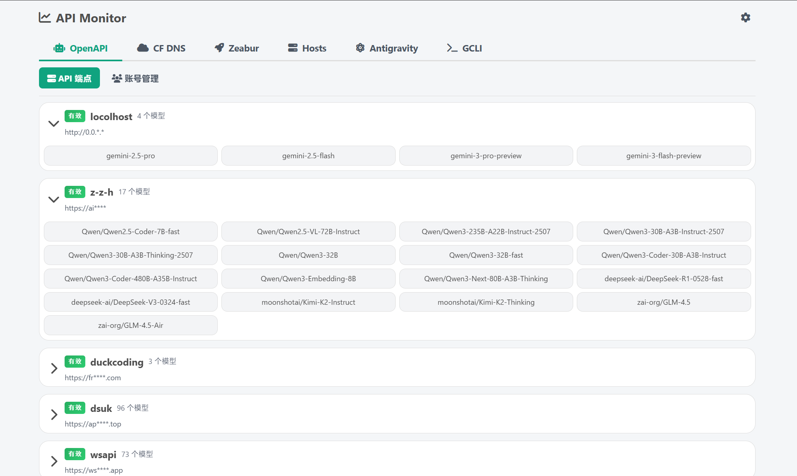
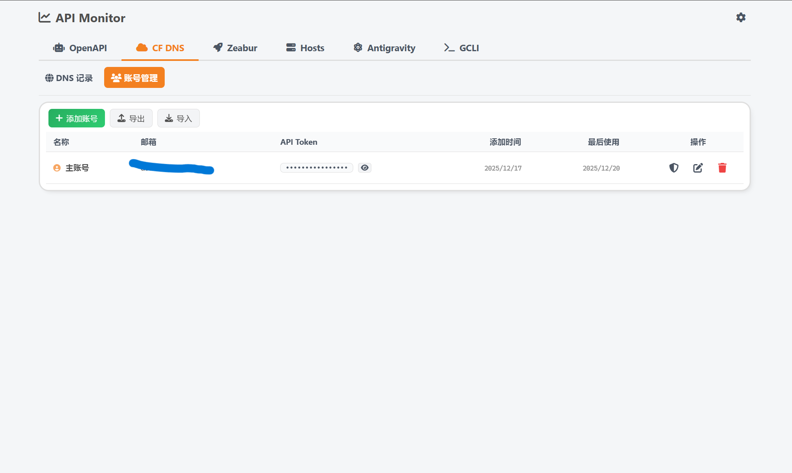
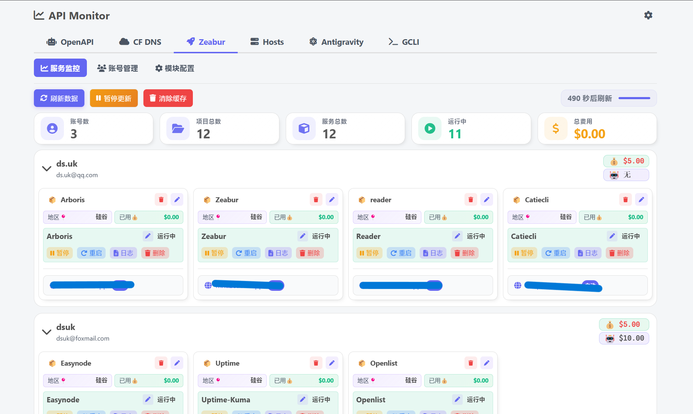
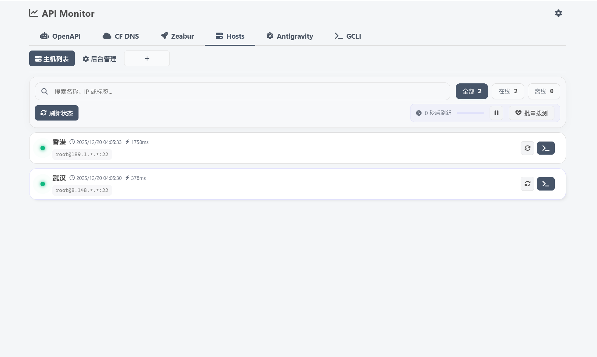
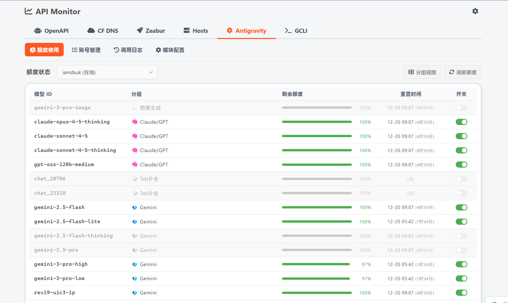
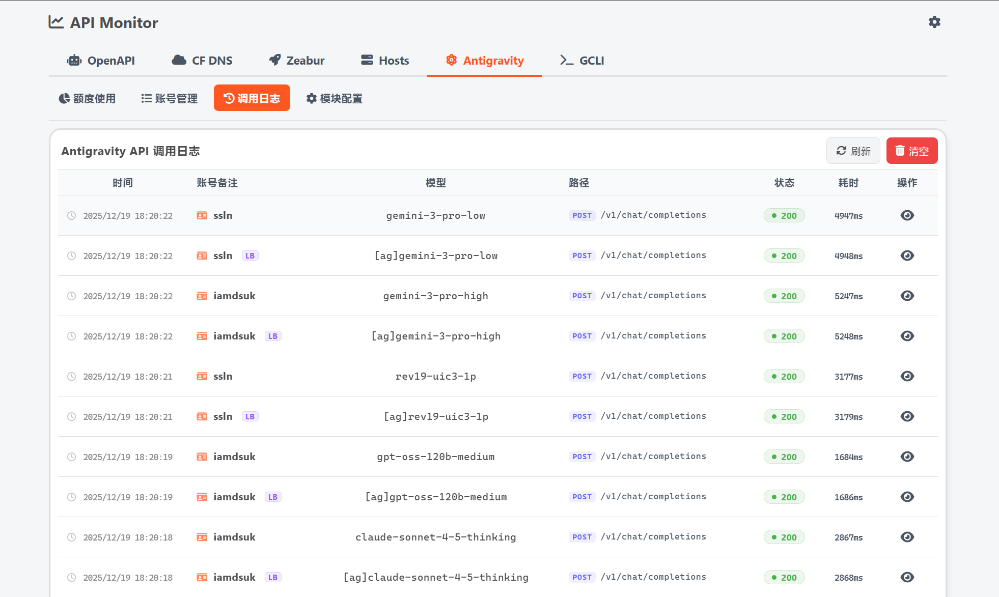
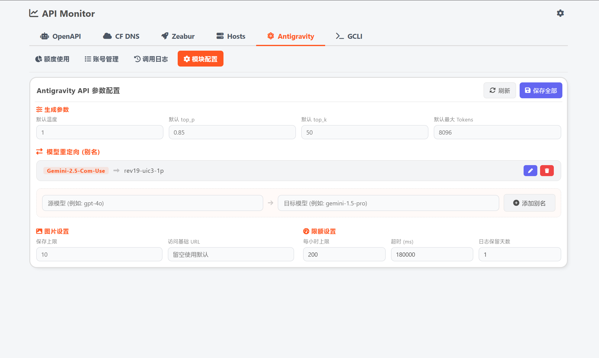
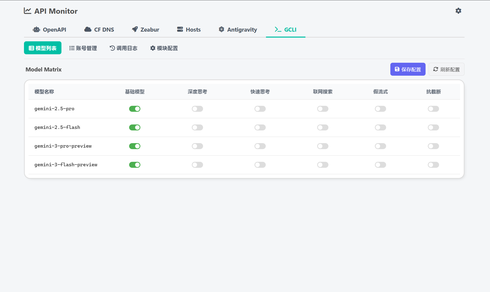

# 🚀 API Monitor Dashboard

【功能迭代中】

一个全能型的 API 管理与服务器监控面板。它不仅能帮您集中管理 Zeabur、Cloudflare、OpenAI 等多种云服务，还提供了强大的主机管理、实时 SSH 终端及 Docker 容器监控功能。

[](https://nodejs.org/)
[](LICENSE)
[](https://www.sqlite.org/)
[](Dockerfile)

---

## 🖼️ 界面预览

|  |  |
| :---: | :---: |
|  |  |

|  |  |
| :---: | :---: |
|  |  |

|  | |
| :---: | :---: |
|  |  |

|  | |
| :---: | :---: |
|  |  |

---

## ✨ 核心特性

### 🖥️ 主机管理 (Hosts)
- **实时监控**：CPU、内存、磁盘及系统负载实时可视化。
- **SSH 终端**：基于 Web 的全功能交互式 SSH 终端，支持多会话切换。
- **Docker 监控**：一键查看、启动、停止及重启容器，实时状态跟踪。
- **自动拨测**：定时检测主机连通性及响应时间，生成历史日志。
- **IP 脱敏**：支持在界面上对主机 IP 进行打码或完全隐藏，保护隐私。

### ☁️ 云服务集成
- **Zeabur**：多账号余额监控、项目费用追踪、服务生命周期管理（启停/日志）。
- **Cloudflare DNS**：多账号域名管理、DNS 记录快速编辑、代理状态切换、配置模板。
- **OpenAI / Antigravity / Gemini**：多端点可用性检测、配额查询、模型列表获取、全链路耗时统计。

### 🛠️ 系统架构与安全
- **全链路追踪**：引入 **Trace ID**，从 HTTP 请求到数据库审计日志实现全生命周期追踪。
- **结构化日志**：基于 Node.js `AsyncLocalStorage` 实现的高性能异步 JSON 日志系统。
- **自动脱敏**：系统自动识别并打码日志及数据库中的 Token、密码、API Key 等敏感信息。
- **持久化存储**：采用 SQLite (`data.db`)，支持千万级日志存量与自动保留策略（按天/按量清理）。

---

## 📁 目录结构

```text
api-monitor/
├── src/
│   ├── db/                 # 数据库模型与迁移 (SQLite)
│   ├── middleware/         # 认证、跨域及 Trace ID 日志中间件
│   ├── routes/             # API 核心路由
│   ├── services/           # 用户设置、会话与日志策略服务
│   └── utils/              # 异步日志器、加密工具
├── modules/                # 独立功能模块
│   ├── server-management/  # 主机、SSH 与 Docker 管理 (核心)
│   ├── zeabur-api/         # Zeabur 业务逻辑
│   ├── cloudflare-dns/     # DNS 管理逻辑
│   ├── antigravity-api/    # Google antigravity 管理
│   └── gemini-cli-api/     # Google Gemini cli 管理
├── public/                 # 前端 Vue.js 3 单页应用
│   ├── js/modules/         # 前端模块化组件
│   └── css/                # 模块化样式表
├── data/                   # 持久化数据目录 (data.db & logs)
├── server.js               # Express 服务入口
└── docker-compose.yml      # 一键部署配置
```

---

## 📦 快速开始

### 1. 本地开发

```bash
# 克隆仓库
git clone https://github.com/iwvw/api-monitor.git
cd api-monitor

# 安装依赖
npm install

# 启动 (默认端口 3000)
npm start
```

### 2. Docker 部署 (推荐)

```bash
docker run -d --name api-monitor \
  -p 3000:3000 \
  -e ADMIN_PASSWORD="your_secure_password" \
  -v $(pwd)/data:/app/data \
  ghcr.io/iwvw/api-monitor:latest
```

---

## 🔒 环境变量

| 变量名 | 默认值 | 说明 |
| :--- | :--- | :--- |
| `PORT` | `3000` | 服务运行端口 |
| `ADMIN_PASSWORD` | - | 初始管理员密码（首次访问可手动设置） |
| `LOG_LEVEL` | `INFO` | 日志记录级别 (DEBUG/INFO/WARN/ERROR) |
| `NODE_ENV` | `production` | 运行环境 |

---

## 🛠️ 运维与设置

### 数据库管理
- 数据库位于 `data/data.db`。
- 系统支持在“系统设置”中导出/导入完整的 `.db` 备份文件。

### 日志策略
- **系统日志**：记录在 `data/logs/app.log`，支持异步写入，不占用业务性能。
- **自动清理**：可在后台配置日志保留天数或最大记录数，系统会自动执行过期清理及 SQLite `VACUUM` 压缩。

### 安全建议
- 建议在生产环境中通过 Nginx 开启 HTTPS。
- 初始登录后请及时前往“系统设置”修改密码。
- 开启主机 IP 脱敏显示以防止在演示时泄露服务器信息。

---

## 📄 许可证

本项目基于 [MIT](LICENSE) 协议开源。

---

**Made with ❤️ by [iwvw](https://github.com/iwvw) & [jiujiu532](https://github.com/jiujiu532)**
