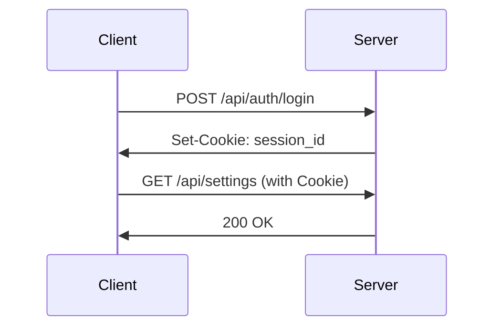

# API Monitor API 接口文档

> **版本**: v2.1.0  
> **最后更新**: 2026-09-08  
> **Base URL**: `http://your-domain:3000`

> **说明**: 本文档是核心接口的精编参考，覆盖常用高频接口。当前 route inventory 为 369 条 Go-owned 路由（`backend-go/internal/manifest/manifest.go`），**完整权威路由清单**请以以下来源为准：
>
> - `node tools/backend-route-inventory.mjs`：从 manifest 提取全量路由（owner/prefix/module/auth/methods）
> - 运行时 `GET /api/system/openapi.json`：OpenAPI 3.1 出口（基于 manifest + 契约自动生成）
> - 面板内「接口文档」页（`/api/system/api-docs`）

---

## 📋 目录

- [认证与授权](#认证与授权)
- [通用响应格式](#通用响应格式)
- [核心接口](#核心接口)
  - [认证接口](#认证接口)
  - [系统设置](#系统设置)
  - [Cloudflare 管理](#cloudflare-管理)
  - [服务器监控](#服务器监控)
  - [AI API 代理](#ai-api-代理)
  - [工具箱](#工具箱)
- [WebSocket 接口](#websocket-接口)
- [错误码说明](#错误码说明)

---

## 认证与授权

### 认证方式

API Monitor 支持以下认证方式:

| 认证方式 | 适用场景 | 请求头 |
|---------|---------|--------|
| **Session** | Web 管理界面 | `Cookie: session_id=xxx` |
| **Admin Password** | 临时访问 | `x-admin-password: <PASSWORD>` |
| **API Key** | OpenAI 兼容 API | `Authorization: Bearer sk-xxx` |
| **Agent Key** | Agent 连接 | `x-agent-key: <AGENT_KEY>` |

### Session 认证流程



---

## 通用响应格式

### 成功响应

```json
{
  "success": true,
  "data": {
    // 数据内容
  },
  "message": "操作成功"  // 可选
}
```

### 错误响应

```json
{
  "success": false,
  "error": "错误描述",
  "code": "ERROR_CODE"  // 可选
}
```

### HTTP 状态码

| 状态码 | 说明 |
|--------|------|
| 200 | 成功 |
| 201 | 创建成功 |
| 400 | 请求参数错误 |
| 401 | 未授权 |
| 403 | 禁止访问 |
| 404 | 资源不存在 |
| 429 | 请求过于频繁 |
| 500 | 服务器内部错误 |

---

## 核心接口

## 认证接口

### 1. 登录

**请求**:
```http
POST /api/auth/login
Content-Type: application/json

{
  "password": "<PASSWORD>",
  "totpToken": "123456"  // 可选，启用2FA时必填
}
```

**响应**:
```json
{
  "success": true,
  "message": "登录成功"
}
```

**错误响应**:
```json
{
  "success": false,
  "require2FA": true,  // 需要2FA验证
  "error": "密码错误"
}
```

### 2. 登出

**请求**:
```http
POST /api/auth/logout
```

**响应**:
```json
{
  "success": true,
  "message": "已安全登出"
}
```

### 3. 检查会话状态

**请求**:
```http
GET /api/auth/session
```

**响应**:
```json
{
  "authenticated": true,
  "user": "admin"
}
```

### 4. 检查密码设置状态

**请求**:
```http
GET /api/auth/check-password
```

**响应**:
```json
{
  "hasPassword": true,
  "isDemoMode": false
}
```

### 5. 2FA 状态查询

**请求**:
```http
GET /api/auth/2fa/status
```

**响应**:
```json
{
  "enabled": true,
  "secret": "<TOTP_SECRET>"  // 仅在启用时返回
}
```

### 6. 2FA 设置与管理

2FA 在启用后拆分为独立接口；`POST /api/auth/2fa` 本身不直接处理启用/禁用请求。

**请求（初始化 / 重新生成密钥）**:
```http
POST /api/auth/2fa/setup
```

**响应**:
```json
{
  "success": true,
  "secret": "<TOTP_SECRET>",
  "qrcode": "data:image/png;base64,..."
}
```

**请求（启用，需校验当前令牌）**:
```http
POST /api/auth/2fa/enable
Content-Type: application/json

{
  "totpToken": "123456"
}
```

**请求（禁用，需校验当前令牌）**:
```http
POST /api/auth/2fa/disable
Content-Type: application/json

{
  "totpToken": "123456"
}
```

**响应**:
```json
{
  "success": true,
  "message": "操作成功"
}
```

---

## 系统设置

### 1. 获取用户设置

**请求**:
```http
GET /api/settings
```

**响应**:
```json
{
  "success": true,
  "data": {
    "themeMode": "auto",
    "pageWidthMode": "standard",
    "sidebarCollapsed": false,
    "customCss": "",
    "moduleVisibility": {
      "dashboard": true,
      "server": true
    },
    "moduleOrder": ["dashboard", "server", "dns"],
    "totpSettings": {
      "hideCode": false,
      "groupByPlatform": true
    }
  }
}
```

### 2. 更新用户设置

**请求**:
```http
PATCH /api/settings
Content-Type: application/json

{
  "themeMode": "dark",
  "pageWidthMode": "wide",
  "customCss": ".custom { color: red; }"
}
```

**响应**:
```json
{
  "success": true,
  "message": "设置已更新"
}
```

### 3. 获取数据库统计

**请求**:
```http
GET /api/settings/database-stats
```

**响应**:
```json
{
  "success": true,
  "data": {
    "fileSize": 2048576,
    "fileSizeHuman": "2.05 MB",
    "tables": {
      "server_accounts": 10,
      "cloudflare_accounts": 5,
      "server_metrics_history": 15230
    }
  }
}
```

### 4. 导出数据库

**请求**:
```http
GET /api/settings/export-database
```

**响应**: 返回 SQLite 数据库文件 (application/x-sqlite3)

### 5. 导入数据库

**请求**:
```http
POST /api/settings/database/import
Content-Type: multipart/form-data

file: [SQLite database file]
```

**响应**:
```json
{
  "success": true,
  "message": "数据库导入成功"
}
```

### 6. 系统主机指标

**请求**:
```http
GET /api/system/host-metrics
```

**响应**:
```json
{
  "success": true,
  "data": {
    "cpu": {
      "usage": 45.2,
      "cores": 8
    },
    "memory": {
      "total": 16777216000,
      "used": 8388608000,
      "percent": 50.0
    },
    "disk": {
      "total": 512000000000,
      "used": 256000000000,
      "percent": 50.0
    }
  }
}
```

---

## Cloudflare 管理

### 1. 账号列表

**请求**:
```http
GET /api/cloudflare/accounts
```

**响应**:
```json
{
  "success": true,
  "data": [
    {
      "id": 1,
      "name": "Main Account",
      "email": "user@example.com",
      "accountId": "cf_account_id_here",
      "createdAt": "2024-01-01T00:00:00Z"
    }
  ]
}
```

### 2. 创建账号

**请求**:
```http
POST /api/cloudflare/accounts
Content-Type: application/json

{
  "name": "New Account",
  "email": "",
  "cfAccountId": "0123456789abcdef0123456789abcdef",
  "apiToken": "<CLOUDFLARE_API_TOKEN>"
}
```

`email` 仅在使用旧版 Global API Key 时填写。推荐使用 Cloudflare API Token 并留空 `email`；如果使用以 `cfat_` 开头的账户 API 令牌，需要填写 `cfAccountId`，系统会使用 `/accounts/{account_id}/tokens/verify` 验证。不要使用以 `v1.0-` 开头的 Origin CA Key / Service Key，该密钥已被 Cloudflare 弃用。

**响应**:
```json
{
  "success": true,
  "data": {
    "id": 2,
    "name": "New Account"
  }
}
```

### 3. 更新账号

**请求**:
```http
PUT /api/cloudflare/accounts/{id}
Content-Type: application/json

{
  "name": "Updated Name",
  "email": "",
  "cfAccountId": "0123456789abcdef0123456789abcdef",
  "apiToken": "<CLOUDFLARE_API_TOKEN>"
}
```

**响应**:
```json
{
  "success": true,
  "message": "账号已更新"
}
```

### 4. 删除账号

**请求**:
```http
DELETE /api/cloudflare/accounts/{id}
```

**响应**:
```json
{
  "success": true,
  "message": "账号已删除"
}
```

### 5. 验证账号 Token

**请求**:
```http
POST /api/cloudflare/accounts/{id}/verify
```

**响应**:
```json
{
  "success": true,
  "data": {
    "valid": true,
    "accountId": "cf_account_id",
    "accountName": "Account Name"
  }
}
```

### 6. 获取域名列表

**请求**:
```http
GET /api/cloudflare/accounts/{id}/zones
```

**响应**:
```json
{
  "success": true,
  "data": [
    {
      "id": "zone_id_here",
      "name": "example.com",
      "status": "active",
      "nameServers": ["ns1.cloudflare.com", "ns2.cloudflare.com"]
    }
  ]
}
```

### 7. DNS 记录列表

**请求**:
```http
GET /api/cloudflare/accounts/{accountId}/zones/{zoneId}/records
```

**响应**:
```json
{
  "success": true,
  "data": [
    {
      "id": "record_id",
      "type": "A",
      "name": "www.example.com",
      "content": "203.0.113.10",
      "proxied": true,
      "ttl": 1
    }
  ]
}
```

### 8. 创建 DNS 记录

**请求**:
```http
POST /api/cloudflare/accounts/{accountId}/zones/{zoneId}/records
Content-Type: application/json

{
  "type": "A",
  "name": "api",
  "content": "198.51.100.20",
  "proxied": true,
  "ttl": 1
}
```

**响应**:
```json
{
  "success": true,
  "data": {
    "id": "new_record_id",
    "type": "A",
    "name": "api.example.com"
  }
}
```

### 9. Workers 脚本列表

**请求**:
```http
GET /api/cloudflare/accounts/{id}/workers
```

**响应**:
```json
{
  "success": true,
  "data": [
    {
      "id": "worker_script_name",
      "createdOn": "2024-01-01T00:00:00Z",
      "modifiedOn": "2024-01-02T00:00:00Z"
    }
  ]
}
```

### 10. 获取 Worker 脚本内容

**请求**:
```http
GET /api/cloudflare/accounts/{id}/workers/{scriptName}
```

**响应**:
```json
{
  "success": true,
  "data": {
    "script": "addEventListener('fetch', event => { ... })",
    "bindings": []
  }
}
```

---

## 服务器监控

### 1. 服务器列表

**请求**:
```http
GET /api/server/accounts
```

**响应**:
```json
{
  "success": true,
  "data": [
    {
      "id": 1,
      "name": "Production Server",
      "host": "203.0.113.100",
      "port": 22,
      "status": "online",
      "agentConnected": true,
      "lastCheckTime": "2024-01-01T12:00:00Z"
    }
  ]
}
```

### 2. 服务器详情

**请求**:
```http
GET /api/server/s/{id}
```

**响应**:
```json
{
  "success": true,
  "data": {
    "id": 1,
    "name": "Production Server",
    "status": "online",
    "metrics": {
      "cpu": 45.2,
      "memory": 60.5,
      "disk": 72.3,
      "networkRx": 1024000,
      "networkTx": 512000
    },
    "uptime": 864000,
    "dockerContainers": 5
  }
}
```

### 3. 创建服务器

**请求**:
```http
POST /api/server/accounts
Content-Type: application/json

{
  "name": "New Server",
  "host": "203.0.113.101",
  "port": 22,
  "username": "root",
  "password": "<PASSWORD>",  // 或使用 privateKey
  "agentEnabled": true
}
```

**响应**:
```json
{
  "success": true,
  "data": {
    "id": 2,
    "name": "New Server"
  }
}
```

### 4. 测试服务器连接

**请求**:
```http
POST /api/server/test-connection
Content-Type: application/json

{
  "host": "203.0.113.100",
  "port": 22,
  "username": "root",
  "password": "password"
}
```

**响应**:
```json
{
  "success": true,
  "message": "连接成功",
  "data": {
    "connected": true,
    "osInfo": "Ubuntu 22.04"
  }
}
```

### 5. 服务器操作 (重启/关机)

**请求**:
```http
POST /api/server/action
Content-Type: application/json

{
  "serverId": 1,
  "action": "reboot"  // reboot/shutdown
}
```

**响应**:
```json
{
  "success": true,
  "message": "重启命令已发送"
}
```

### 6. 获取最新指标

**请求**:
```http
GET /api/server/metrics/latest/{id}
```

**响应**:
```json
{
  "success": true,
  "data": {
    "cpu": 45.2,
    "memory": 60.5,
    "disk": 72.3,
    "networkRx": 1024000,
    "networkTx": 512000,
    "timestamp": "2024-01-01T12:00:00Z"
  }
}
```

### 7. 获取历史指标

**请求**:
```http
GET /api/server/s/{id}/history?start=2024-01-01T00:00:00Z&end=2024-01-02T00:00:00Z
```

**响应**:
```json
{
  "success": true,
  "data": [
    {
      "cpu": 45.2,
      "memory": 60.5,
      "timestamp": "2024-01-01T12:00:00Z"
    }
  ]
}
```

### 8. Agent 安装命令

**请求**:
```http
GET /api/server/agent/command/{id}
```

**响应**:
```json
{
  "success": true,
  "data": {
    "linux": "curl -sSL http://your-domain:3000/api/server/agent/install-script/1 | bash",
    "windows": "powershell -Command \"Invoke-WebRequest -Uri 'http://your-domain:3000/api/server/agent/install/win/1/agent_key' -OutFile agent.exe; .\\agent.exe\""
  }
}
```

### 9. SFTP 文件列表

**请求**:
```http
POST /api/server/sftp/list
Content-Type: application/json

{
  "serverId": 1,
  "path": "/home/user"
}
```

**响应**:
```json
{
  "success": true,
  "data": [
    {
      "name": "file.txt",
      "size": 1024,
      "mode": "0644",
      "isDir": false,
      "modTime": "2024-01-01T12:00:00Z"
    }
  ]
}
```

---

## AI API 代理

### 1. 模型列表 (OpenAI 兼容)

**请求**:
```http
GET /v1/models
Authorization: Bearer <API_KEY>
```

**响应**:
```json
{
  "object": "list",
  "data": [
    {
      "id": "gpt-4",
      "object": "model",
      "created": 1677649963,
      "owned_by": "openai"
    },
    {
      "id": "gemini-pro",
      "object": "model",
      "owned_by": "google"
    }
  ]
}
```

### 2. 聊天完成 (OpenAI 兼容)

**请求**:
```http
POST /v1/chat/completions
Content-Type: application/json
Authorization: Bearer <API_KEY>

{
  "model": "gpt-4",
  "messages": [
    {
      "role": "user",
      "content": "Hello!"
    }
  ],
  "stream": false
}
```

**响应**:
```json
{
  "id": "chatcmpl-123",
  "object": "chat.completion",
  "created": 1677652288,
  "model": "gpt-4",
  "choices": [
    {
      "index": 0,
      "message": {
        "role": "assistant",
        "content": "Hello! How can I help you?"
      },
      "finish_reason": "stop"
    }
  ],
  "usage": {
    "prompt_tokens": 9,
    "completion_tokens": 12,
    "total_tokens": 21
  }
}
```

### 3. OpenAI 端点管理

**请求**:
```http
GET /api/openai
```

**响应**:
```json
{
  "success": true,
  "data": [
    {
      "id": 1,
      "name": "OpenAI Official",
      "baseUrl": "https://api.openai.com/v1",
      "enabled": true,
      "createdAt": "2024-01-01T00:00:00Z"
    }
  ]
}
```

### 4. 创建 OpenAI 端点

**请求**:
```http
POST /api/openai
Content-Type: application/json

{
  "name": "Custom Endpoint",
  "baseUrl": "https://custom-api.example.com/v1",
  "apiKey": "<API_KEY>",
  "enabled": true
}
```

**响应**:
```json
{
  "success": true,
  "data": {
    "id": 2,
    "name": "Custom Endpoint"
  }
}
```

---

## 工具箱

### TOTP 管理

#### 1. TOTP 列表

**请求**:
```http
GET /api/totp/accounts
```

**响应**:
```json
{
  "success": true,
  "data": [
    {
      "id": 1,
      "name": "GitHub",
      "issuer": "GitHub",
      "account": "user@example.com",
      "type": "totp"
    }
  ]
}
```

#### 2. 创建 TOTP

**请求**:
```http
POST /api/totp/accounts
Content-Type: application/json

{
  "name": "Google",
  "secret": "<TOTP_SECRET>",
  "issuer": "Google",
  "account": "user@example.com",
  "type": "totp"
}
```

**响应**:
```json
{
  "success": true,
  "data": {
    "id": 2,
    "name": "Google"
  }
}
```

### Uptime 监测

#### 1. 监测列表

**请求**:
```http
GET /api/uptime/monitors
```

**响应**:
```json
{
  "success": true,
  "data": [
    {
      "id": 1,
      "name": "Website Monitor",
      "type": "http",
      "url": "https://example.com",
      "interval": 60,
      "enabled": true,
      "status": "up"
    }
  ]
}
```

#### 2. 创建监测

**请求**:
```http
POST /api/uptime/monitors
Content-Type: application/json

{
  "name": "API Monitor",
  "type": "http",
  "url": "https://api.example.com/health",
  "interval": 60,
  "enabled": true
}
```

**响应**:
```json
{
  "success": true,
  "data": {
    "id": 2,
    "name": "API Monitor"
  }
}
```

#### 3. 公开状态页

公开状态页改为按 slug 访问，不再通过 `?id=` 查询。

**请求**:
```http
GET /api/uptime/public/status-pages/{slug}
```

公开状态页也支持按自定义域名查找与徽标：

```http
GET /api/uptime/public/status-page-by-domain?domain=status.example.com
GET /api/uptime/public/badge/{id}
```

**响应（status-pages）**:
```json
{
  "success": true,
  "data": {
    "name": "Website Monitor",
    "status": "up",
    "uptime": 99.9,
    "avgResponseTime": 120,
    "history": [
      {
        "timestamp": "2024-01-01T12:00:00Z",
        "status": "up",
        "responseTime": 115
      }
    ]
  }
}
```

### Filebox 文件分享

文件分享已重构为「分享（share）」模型，大文件走分片上传（init-upload → complete-upload）。

#### 1. 创建分享（普通小文件）

**请求**:
```http
POST /api/filebox/shares
Content-Type: application/json

{
  "name": "document.pdf",
  "mime": "application/pdf",
  "size": 1048576,
  "data": "<BASE64_OR_TEXT_DATA>",
  "password": "<OPTIONAL_PASSWORD>",
  "expiresIn": 3600,
  "maxDownloads": 10
}
```

**响应**:
```json
{
  "success": true,
  "data": {
    "code": "abc123def456",
    "url": "http://your-domain:3000/share/abc123def456",
    "expiresAt": "2024-01-01T13:00:00Z"
  }
}
```

#### 2. 分片上传（大文件）

先初始化：

```http
POST /api/filebox/shares/init-upload
Content-Type: application/json

{
  "name": "big-file.iso",
  "mime": "application/octet-stream",
  "size": 536870912,
  "password": "",
  "expiresIn": 86400
}
```

再完成上传（携带分片数据）：

```http
POST /api/filebox/shares/complete-upload
Content-Type: application/json

{
  "uploadId": "<UPLOAD_ID>",
  "chunks": [ ... ]
}
```

#### 3. 下载文件

**请求**（公开分享码，重定向到实际文件）:
```http
GET /share/{code}
```

分享列表与删除：

```http
GET /api/filebox/shares
DELETE /api/filebox/shares/{code}
```

#### 4. 文件列表 / 节点

```http
GET /api/filebox/shares
GET /api/filebox/storage-nodes
```

---

## WebSocket 接口

### Engine.IO 连接 (Agent)

**连接 URL**: `ws://your-domain:3000/socket.io/`

**握手流程**:

1. **HTTP GET** → `/socket.io/?EIO=4&transport=polling`
2. **响应**: `{"sid":"session_id","upgrades":["websocket"]}`
3. **WebSocket 升级** → `ws://your-domain:3000/socket.io/?EIO=4&transport=websocket&sid=session_id`

**认证消息**:

```json
["auth", {
  "server_id": "1",
  "agent_key": "your_<AGENT_KEY>"
}]
```

**状态上报**:

```json
["agent:state", {
  "cpu": 45.2,
  "memory": 60.5,
  "disk": 72.3,
  "network": {
    "rx": 1024000,
    "tx": 512000
  }
}]
```

---

## 错误码说明

| 错误码 | 说明 |
|--------|------|
| `INVALID_PASSWORD` | 密码错误 |
| `REQUIRE_2FA` | 需要双因子认证 |
| `INVALID_2FA_TOKEN` | 2FA 令牌无效 |
| `RATE_LIMIT_EXCEEDED` | 请求频率超限 |
| `UNAUTHORIZED` | 未授权访问 |
| `NOT_FOUND` | 资源不存在 |
| `VALIDATION_ERROR` | 参数验证失败 |
| `DATABASE_ERROR` | 数据库操作失败 |
| `EXTERNAL_API_ERROR` | 外部 API 调用失败 |

---

## 示例代码

### JavaScript/Fetch

```javascript
// 登录（成功后持有 HttpOnly 会话 Cookie）
const login = async (password) => {
  const response = await fetch('/api/auth/login', {
    method: 'POST',
    headers: { 'Content-Type': 'application/json' },
    body: JSON.stringify({ password }),
  });
  return await response.json();
};

// 获取服务器列表（浏览器自动携带会话 Cookie）
const getServers = async () => {
  const response = await fetch('/api/server/accounts', {
    credentials: 'same-origin',
  });
  return await response.json();
};
```

### cURL

```bash
# 登录并保存会话 Cookie
curl -c cookies.txt -X POST http://localhost:3000/api/auth/login \
  -H "Content-Type: application/json" \
  -d '{"password":"<ADMIN_PASSWORD>"}'

# 获取 Cloudflare 账号列表
curl -b cookies.txt http://localhost:3000/api/cloudflare/accounts

# 创建 DNS 记录
curl -b cookies.txt -X POST http://localhost:3000/api/cloudflare/accounts/1/zones/zone_id/records \
  -H "Content-Type: application/json" \
  -d '{
    "type": "A",
    "name": "api",
    "content": "203.0.113.10",
    "proxied": true
  }'
```

### Python/Requests

```python
import requests

base_url = "http://localhost:3000"
password = "<ADMIN_PASSWORD>"

# 登录（保留会话）
session = requests.Session()
login_response = session.post(
    f"{base_url}/api/auth/login",
    json={"password": password}
)

# 获取服务器列表
servers = session.get(f"{base_url}/api/server/accounts").json()

print(servers)
```

---

**文档持续更新中，如有疑问请提交 Issue。**
