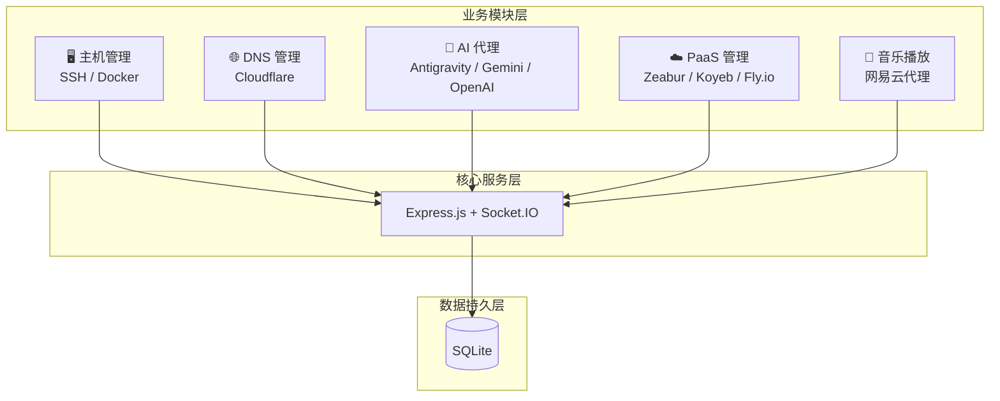
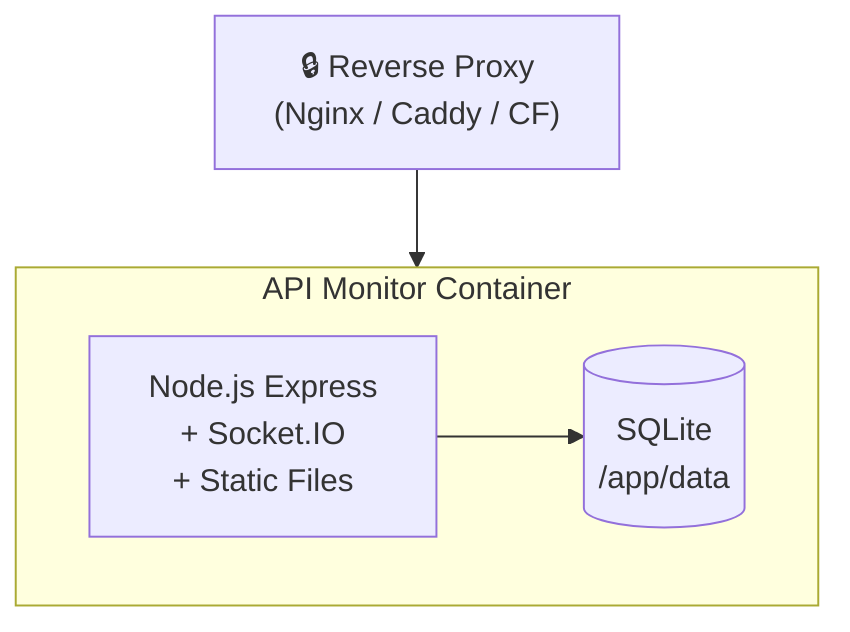

# 🏛️ API Monitor 架构文档

> **版本**: v0.1.2 | **更新**: 2026-01-02

---

## 系统概述

API Monitor 是一个多 API 聚合监控面板，采用 **单体模块化** 架构，将多种云服务、服务器管理、音乐代理等功能集成于一体。



---

## 技术栈

| 层级 | 技术 | 说明 |
|------|------|------|
| **前端** | Vue 3 + Pinia | 响应式状态管理 |
| **构建** | Vite 7 | 极速 HMR 开发体验 |
| **后端** | Express.js | HTTP API 服务 |
| **实时** | Socket.IO | WebSocket 双向通信 |
| **数据库** | SQLite | 同步 API (better-sqlite3) |
| **安全** | Helmet + Zod | 安全头 + 运行时校验 |

---

## 目录结构

```
api-monitor/
├── server.js              # 应用入口
├── src/                   # 核心源码
│   ├── js/modules/        # 前端业务模块 (32个)
│   ├── css/               # 样式文件
│   ├── db/                # 数据库层
│   ├── middleware/        # Express 中间件
│   ├── routes/            # API 路由注册
│   ├── services/          # 业务服务
│   └── utils/             # 工具函数
├── modules/               # 可插拔业务模块 (13个)
│   ├── server-api/        # 服务器/SSH/Docker
│   ├── cloudflare-api/    # Cloudflare DNS
│   ├── antigravity-api/   # Antigravity Agent
│   ├── gemini-cli-api/    # Gemini CLI
│   ├── zeabur-api/        # Zeabur PaaS
│   ├── koyeb-api/         # Koyeb PaaS
│   ├── flyio-api/         # Fly.io
│   ├── music-api/         # 网易云音乐代理
│   ├── totp-api/          # 2FA 管理
│   └── ...
├── data/                  # 持久化目录 (挂载点)
└── dist/                  # 生产构建产物
```

---

## 核心架构

### 请求处理流程

```
Request → Security → RateLimit → Auth → Validator → Router → Handler → Response
             │           │          │        │
             │           │          │        └── Zod Schema 验证
             │           │          └── Session Cookie 认证
             │           └── 分级限流 (全局/登录/API)
             └── Helmet 安全头
```

### 模块系统

每个 `modules/xxx-api/` 目录是独立的功能单元：

```javascript
modules/xxx-api/
├── router.js     // Express 路由定义
├── service.js    // 业务逻辑
├── xxx.js        // 前端逻辑 (可选)
└── xxx.css       // 前端样式 (可选)
```

模块在 `src/routes/index.js` 中注册挂载。

### 数据库层

采用 Repository 模式，预编译 SQL 语句：

```
src/db/
├── database.js      # 数据库连接与初始化
├── statements.js    # 预编译 SQL 缓存
└── models/          # 数据模型类
```

### 实时通信

Socket.IO 命名空间划分：

| 命名空间 | 用途 |
|----------|------|
| `/` | 全局通知 |
| `/server` | 服务器状态推送 |
| `/terminal` | 终端 |
| `/logs` | 实时日志流 |

---

## 安全设计

| 措施 | 实现 |
|------|------|
| 传输加密 | HTTPS (反向代理提供) |
| 安全头 | Helmet (CSP, HSTS, X-Frame-Options) |
| 速率限制 | express-rate-limit 分级控制 |
| 认证 | Session Cookie + 可选 TOTP |
| 输入验证 | Zod Schema 运行时校验 |
| 敏感数据 | AES-256-GCM 加密存储 |
| 日志脱敏 | 自动识别并打码 Token/密码 |

---

## API 规范

### RESTful 约定

| 方法 | 路径 | 操作 |
|------|------|------|
| `GET` | `/api/{module}` | 列表 |
| `GET` | `/api/{module}/:id` | 详情 |
| `POST` | `/api/{module}` | 创建 |
| `PUT` | `/api/{module}/:id` | 更新 |
| `DELETE` | `/api/{module}/:id` | 删除 |

### 响应格式

**成功响应：**

```json
{ "success": true, "data": { ... } }
```

**错误响应：**

```json
{ "success": false, "error": { "code": "ERROR_CODE", "message": "..." } }
```

---

## 部署架构



### 关键环境变量

| 变量 | 默认值 | 说明 |
|------|--------|------|
| `PORT` | 3000 | 服务端口 |
| `ADMIN_PASSWORD` | - | 初始管理员密码 |
| `JWT_SECRET` | (随机) | 会话 Token 加密密钥 |
| `DATA_DIR` | /app/data | 数据持久化目录 |
| `LOG_LEVEL` | INFO | 日志级别 |

---

## 扩展开发

### 添加新模块

1. 创建 `modules/new-api/` 目录
2. 实现 `router.js` 路由
3. 在 `src/routes/index.js` 注册
4. 按需添加数据模型和前端组件

详见 → [模块开发模板](../modules/_template/README.md)
