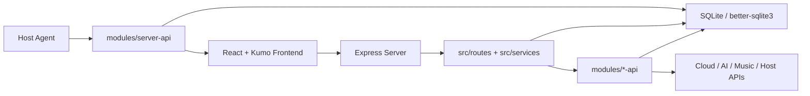

# API Monitor 设计文档

最后更新：2026-06-09

API Monitor 是一个单体模块化的 API 管理、云服务管理与主机监控面板。当前技术主线是 **Express + React 19 + Zustand + @cloudflare/kumo 2.5.0 + Tailwind CSS v4 + SQLite**。

## 架构概览

系统由三层组成：

1. 核心层：`src/`，负责应用入口、鉴权、中间件、全局数据库、系统设置、日志、健康检查和统一路由挂载。
2. 模块层：`modules/*-api/`，每个业务域独立维护 router、storage、schema 和服务逻辑。
3. 前端层：`src/js/`，React 单页应用，`MainLayout` 负责侧边栏、顶栏、页面宽度和路由状态，页面组件负责各自业务。

## 核心层

`src/routes/index.js` 统一注册核心路由和业务模块路由。核心路由包括：

- `/health`
- `/api/auth`
- `/api/settings`
- `/api/system`
- `/api/logs`
- `/v1`
- `/api/server/agent/*`

核心服务集中在 `src/services/`，包括用户设置、会话、日志、系统 2FA、指标等。数据库初始化和基础模型位于 `src/db/`。

## 模块层

业务模块使用 `modules/*-api/` 目录，例如：

- `server-api`：主机实例、Agent、SSH/SFTP、Docker、历史指标。
- `cloudflare-api`：Cloudflare 账号、域名、DNS、Workers、Pages、R2、Tunnels。
- `openai-api`：OpenAI 兼容端点、模型、聊天与日志。
- `gemini-cli-api`、`qwen-api`：AI 代理与调用统计。
- `koyeb-api`、`flyio-api`：PaaS 平台状态同步。
- `music-api`：网易云音乐代理。
- `totp-api`、`filebox-api`、`uptime-api`、`notification-api`、`openlist-api`、`aliyun-api`、`tencent-api`：工具与云厂商能力。

模块 schema 必须幂等，使用 `CREATE TABLE IF NOT EXISTS` 和必要索引。模块内部可以拥有自己的表，但不要直接依赖其他模块表的外键；跨模块数据通过服务层协调。

## 前端层

React 入口是 `src/js/main.jsx`，当前主页面都在 `src/js/pages/`。`src/js/store.js` 使用 Zustand 管理：

- 当前模块。
- 模块显隐与顺序。
- 主题偏好。
- 页面宽度偏好。
- 用户设置加载状态。

`src/js/components/MainLayout.jsx` 使用 Kumo `Sidebar` 搭建应用壳层，并通过 URL path 同步当前模块。顶栏当前使用紧凑版 `AppPageHeader`，组合 Kumo `Breadcrumbs` 与 `Tabs`。

当前壳层状态：

- 侧栏展开/收起状态会写入后端用户设置，并与本地 UI 状态同步。
- 页面宽度偏好支持 `标准 / 宽屏 / 全宽`，由设置侧栏的小号 Kumo Tabs 控制。
- 主题初始化脚本位于 `src/index.html` 的 head 内，优先读取本地持久化值，避免暗色启动闪白。
- 展开/收起动效通过 `AnimatedCollapse` 统一接入 Kumo `Collapsible`，使用 Base UI 的 `--collapsible-panel-height` 状态变量，不再依赖旧自绘动画类。

## UI 设计原则

- 基础 UI 组件必须使用 Kumo。
- 表格使用 Kumo `Table`，数据密集表格使用 `Table.ResizeHandle`。
- 图表使用 Kumo `TimeseriesChart` / `Meter` / `ChartPalette`。
- 删除确认优先迁移到 Kumo `DeleteResource`。
- Toolbar、筛选行和内部层级 tabs 使用 `size="sm"`。
- 主题色、边框、文字、背景使用 Kumo token。
- 列表展开、Docker 子面板、说明面板等折叠区使用 `AnimatedCollapse`，不得恢复旧 `app-collapse-panel` / `quick-fade-in` / `motion-pop-in` 类。

详细规则见 [KUMO_MIGRATION_RULES.md](./KUMO_MIGRATION_RULES.md)。

## 数据与一致性

SQLite 是系统唯一持久化数据库。配置、密钥、账号、模块状态等强一致数据必须同步落库后再返回成功。日志、指标、遥测等高频弱一致数据可以做批处理或缓存，但必须保证最终可查询。

敏感 token 和云厂商凭证应走加密存储工具，不在前端明文长期保存。

## 已废弃内容

- 旧 Vue 前端入口不再是当前方案。
- Pinia、模板加载器、旧 `src/templates/` 不再作为当前前端基线。
- Chart.js 不再作为当前图表基线。
- 独立 `ai-chat` 和独立 Antigravity 页面不再是当前主导航模块。

## 当前风险

- 删除确认已通过全局弹窗宿主接入 Kumo `DeleteResource`；后续只需对高频场景补充更精确的 `resourceType` / `resourceName`。
- 官方 `PageHeader` 是 block source，不是当前 barrel 运行时导出；替换本地紧凑顶栏前必须先安装/复制并适配。
- 仍需建立全路由自动 smoke，覆盖桌面、窄屏、暗色主题和主要弹窗。
- SSH/终端、Docker 更新、Agent 遥测、Cloudflare/PaaS 等仍需要真实外部环境持续回归。
