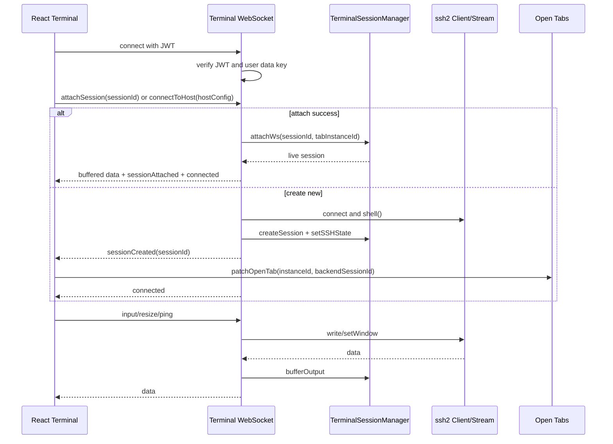
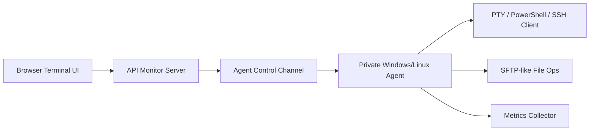

# Termix 项目分析报告

最后更新：2026-06-08

参考项目：`E:\Code\Termix`

本文档用于给后续对话或 agent 参考，目标是把 Termix 中对 API Monitor 主机、终端、SFTP、Docker、资源监控重构有价值的设计沉淀下来。本文只做分析，不代表 API Monitor 已经实现对应能力。

## 结论摘要

Termix 是一个成熟的自托管 SSH 与远程管理平台，定位接近“Termius 的自托管替代”。它同时支持 Web/PWA、Electron 桌面端和 Docker 部署。

对 API Monitor 最有价值的是：

1. 终端会话的三层恢复模型：前端 WebSocket 重连、后端 SSH session detach/attach、可选 tmux。
2. 多标签页与后端 session 的绑定：前端 tab instance 保存 `backendSessionId`，刷新后优先 attach。
3. SFTP 与终端共享 host/credential/auth 语义，但使用独立 SFTP session。
4. Docker 通过 SSH 执行 Docker CLI，并有独立 session、validate、stats、console。
5. 资源监控按需启动轮询，使用 viewer heartbeat、缓存、请求队列和 backoff 控制。
6. 安全层把“用户数据解锁状态”和连接能力绑定，未解锁时终端 WebSocket 直接拒绝。

不能直接照搬的是：

1. Termix 前端组件体系是 Shadcn/Radix/Tailwind，不符合 API Monitor 当前 Kumo-only 规范。
2. Termix 的监控采集不包含 CPU 温度和功耗，不能解决 API Monitor 当前温度/功耗采集问题。
3. Termix 的 C2S tunnel 不是完整 agent 体系，只能作为“反连/隧道”参考，不能直接满足无公网 Windows agent 终端需求。

## 技术栈

核心依赖来自 `E:\Code\Termix\package.json`：

- 前端：React 19、TypeScript、Vite、Tailwind CSS v4、Shadcn/Radix、Lucide。
- 终端：`@xterm/xterm`、`react-xtermjs`、`@xterm/addon-fit`、`@xterm/addon-clipboard`、`@xterm/addon-unicode11`、`@xterm/addon-web-links`。
- 后端：Express 5、`ws`、`ssh2`、`better-sqlite3`、Drizzle ORM。
- 远程桌面：Guacamole。
- 文件/编辑：CodeMirror、Monaco、PDF/image/audio preview。
- 安全：JWT、bcrypt、字段加密、数据库文件加密、Electron safeStorage。

结论：xterm 仍然是浏览器终端的主线选择。它的生态、fit/clipboard/weblink/unicode addon、React 封装和长期维护状态都优于手写终端。

## 项目地图

关键目录：

| 路径 | 说明 |
|------|------|
| `E:\Code\Termix\src\backend` | Node/Express 后端服务 |
| `E:\Code\Termix\src\backend\ssh` | SSH、终端、SFTP、Docker、资源监控、Tunnel |
| `E:\Code\Termix\src\backend\database` | 主 API、用户、host、credential、open tabs、RBAC、导入导出 |
| `E:\Code\Termix\src\backend\database\db` | Drizzle schema 与 SQLite 初始化 |
| `E:\Code\Termix\src\ui` | React 前端 |
| `E:\Code\Termix\src\ui\features\terminal` | xterm 终端组件 |
| `E:\Code\Termix\src\ui\features\file-manager` | SFTP 文件管理器 |
| `E:\Code\Termix\src\ui\features\docker` | Docker 管理 |
| `E:\Code\Termix\src\ui\features\server-stats` | 资源监控 |
| `E:\Code\Termix\src\ui\shell` | 标签页、分屏、命令面板 |
| `E:\Code\Termix\electron` | Electron 主进程、Cookie、代理、本地后端启动 |
| `E:\Code\Termix\docker` | Docker/Nginx 部署配置 |

后端入口：

- `E:\Code\Termix\src\backend\starter.ts`
- `E:\Code\Termix\src\backend\database\database.ts`

`starter.ts` 初始化顺序大致是：

1. 读取 `.env` 和持久化配置。
2. 初始化 `SystemCrypto`、JWT secret、数据库密钥、字段加密密钥、内部 token。
3. 初始化数据库。
4. 初始化 `AuthManager` 和 `DataCrypto`。
5. 启动主 API、终端、隧道、文件管理、资源监控、Docker、Dashboard、Guacamole。
6. 注册 graceful shutdown，退出前保存内存数据库。

## 服务拓扑

Termix 后端拆成多个端口，再由 Nginx 或 Electron/前端代理接入：

| 服务 | 文件 | 端口/职责 |
|------|------|-----------|
| 主 API | `src/backend/database/database.ts` | 用户、host、credential、open tabs、settings、导入导出 |
| 终端 WebSocket | `src/backend/ssh/terminal.ts` | SSH shell 转发、会话恢复、tmux、认证交互 |
| SFTP HTTP API | `src/backend/ssh/file-manager.ts` | 文件列表、上传、下载、编辑、权限、压缩、传输 |
| 资源监控 | `src/backend/ssh/server-stats.ts` | 状态探测、指标轮询、viewer heartbeat |
| Docker HTTP API | `src/backend/ssh/docker.ts` | Docker session、validate、容器操作 |
| Docker console WS | `src/backend/ssh/docker-console.ts` | `docker exec -it` 控制台 |
| Tunnel | `src/backend/ssh/tunnel.ts` | local/remote/dynamic/C2S tunnel |

API Monitor 当前可以不用照搬多端口结构，但需要照搬“功能域隔离”的边界：终端、SFTP、Docker、监控不能继续挤在一个页面或一个 router 里。

## 终端架构

关键文件：

- 后端：`E:\Code\Termix\src\backend\ssh\terminal.ts`
- 会话管理：`E:\Code\Termix\src\backend\ssh\terminal-session-manager.ts`
- 前端：`E:\Code\Termix\src\ui\features\terminal\Terminal.tsx`
- 标签页：`E:\Code\Termix\src\ui\shell\TabContext.tsx`
- 持久化标签：`E:\Code\Termix\src\backend\database\routes\open-tabs.ts`

### 终端连接流程

### 后端会话模型

`TerminalSessionManager` 的关键能力：

- session 字段包括 `id`、`userId`、`hostId`、`tabInstanceId`、`sshConn`、`sshStream`、`attachedWs`、`outputBuffer`、`tmuxSessionName`。
- 默认输出缓冲上限：512KB。
- 默认 detached timeout：30 分钟，可从 `terminal_session_timeout_minutes` 设置读取。
- 每用户最多 10 个 session，超限时优先清理 detached session。
- WebSocket close 时，如果 SSH session 仍连接，则 detach；否则 destroy。
- attach 时会校验 userId、session connected 状态、tab instance 冲突。
- attach 成功后返回已有 buffer，并同步 resize。

这套设计可以解决 API Monitor 当前“刷新/短断线后终端丢失”的问题。

### 前端终端模型

`Terminal.tsx` 使用：

- `react-xtermjs` 创建 xterm。
- `FitAddon` 处理容器变化后的 rows/cols。
- `ClipboardAddon` + 自定义 `RobustClipboardProvider`。
- `Unicode11Addon`。
- `WebLinksAddon`。
- `terminal.onData` 将输入发给后端。
- 前端 ping/pong 判断 WebSocket 存活。
- abnormal close 时指数退避重连，最大 8 次。
- 如果有 `restoredSessionId`，先发 `attachSession`，失败再 `connectToHost`。

前端消息类型包括：

- `connectToHost`
- `attachSession`
- `resize`
- `disconnect`
- `get_cwd`
- `input`
- `ping`
- `totp_response`
- `password_response`
- `reconnect_with_credentials`
- `tmux_attach`
- `tmux_detach`
- `opkssh_start_auth`
- `opkssh_auth_completed`

后端返回类型包括：

- `data`
- `connected`
- `disconnected`
- `sessionCreated`
- `sessionAttached`
- `sessionExpired`
- `sessionTakenOver`
- `totp_required`
- `totp_retry`
- `passphrase_required`
- `host_key_verification_required`
- `host_key_changed`
- `tmux_sessions_available`
- `tmux_session_created`
- `tmux_session_attached`
- `tmux_unavailable`
- `connection_log`

### 恢复策略

Termix 的恢复不是单点能力，而是三层：

1. 前端 WebSocket 断开后自动重连。
2. 后端 SSH session 未销毁时，重新 attach。
3. 可选自动 tmux：后端检测 tmux，选择已有 session 或创建新 session。

API Monitor 应采用类似模型：

- WebSocket 短断线：attach 原 session。
- 浏览器刷新：从 tab 持久化拿 `backendSessionId` attach。
- 服务端重启或 SSH session 真断：若 Linux 主机有 tmux，用 tmux 恢复 shell 历史。
- Windows/无公网 agent：需要 agent 侧持久 PTY 或 PowerShell session，不能靠 tmux。

## 多标签页与分屏

关键文件：

- `E:\Code\Termix\src\ui\shell\TabContext.tsx`
- `E:\Code\Termix\src\ui\shell\TabBar.tsx`
- `E:\Code\Termix\src\ui\shell\SplitView.tsx`
- `E:\Code\Termix\src\backend\database\routes\open-tabs.ts`

设计要点：

- 每个 tab 有前端 `id` 和稳定的 `instanceId`。
- 终端 tab 会持有 `terminalRef`。
- open tabs 后端表 `user_open_tabs` 保存 `tabType`、`hostId`、`label`、`tabOrder`、`backendSessionId`。
- 用户设置 `reopenTabsOnLogin` 控制是否恢复标签。
- 分屏支持 2 到 6 panes。
- pane 里有 focused 状态。
- tab 拖拽 reorder 与 split assignment 分离。

API Monitor 当前终端分屏可以借鉴：

- 分屏状态不要隐含在 DOM 结构里，应有明确 `paneId -> terminalTabId` 映射。
- 关闭 split pane 时必须同时清理 pane assignment，避免留下空终端窗口。
- 拖拽分屏时应先显示 drop placeholder，再提交状态变更。
- 激活 pane 与激活 tab 应分开建模。

## SFTP 文件管理

关键文件：

- 后端入口：`E:\Code\Termix\src\backend\ssh\file-manager.ts`
- session 工具：`E:\Code\Termix\src\backend\ssh\file-manager-session.ts`
- 前端：`E:\Code\Termix\src\ui\features\file-manager\FileManager.tsx`
- 文件管理内嵌终端：`E:\Code\Termix\src\ui\features\file-manager\components\TerminalWindow.tsx`

设计要点：

- SFTP 使用 HTTP API，不复用 terminal WebSocket。
- SFTP session 独立管理，默认 30 分钟清理。
- `getSessionSftp(session)` 缓存 SFTPWrapper，失败时清空重建。
- `ChannelOpenSerializer` 串行化 SSH channel open，避免并发打开 SFTP/exec 时触发 channel open failure。
- 前端有 current host、current path、nav history、selected files、clipboard、undo history、pinned/recent/shortcut、sudo dialog。
- 支持拖拽上传、拖到桌面、服务端到服务端传输、文件预览、代码编辑、压缩、权限修改。
- 文件管理内可以打开一个 `TerminalWindow`，并传入 `initialPath` 或 `executeCommand`。

对 API Monitor 的建议：

1. 底部 SFTP 应跟随当前激活终端 tab 的 host 切换。
2. SFTP session 不必等同 terminal session，但必须共享同一个 host credential resolver。
3. 如果当前终端知道 cwd，可以用 `get_cwd` 或 agent 事件同步到 SFTP 初始路径。
4. 文件传输应独立于终端 WebSocket，避免大文件阻塞终端交互。
5. SFTP session 需要 keepalive 和 active operation 计数，不能操作中被清理。

## Docker 管理

关键文件：

- `E:\Code\Termix\src\backend\ssh\docker.ts`
- `E:\Code\Termix\src\backend\ssh\docker-container-routes.ts`
- `E:\Code\Termix\src\backend\ssh\docker-console.ts`
- `E:\Code\Termix\src\ui\features\docker\DockerManager.tsx`
- `E:\Code\Termix\src\ui\features\docker\components\ConsoleTerminal.tsx`
- `E:\Code\Termix\src\ui\features\docker\components\ContainerStats.tsx`

设计要点：

- Docker 能力通过 SSH 执行 Docker CLI。
- 前端先 `connectDockerSession`，再 `validateDockerAvailability`。
- 支持 TOTP/Warpgate/auth required 流程。
- 容器列表命令：
  - `docker ps -a --format '{...json...}'`
- 容器详情：
  - `docker inspect`
- 容器操作：
  - start/stop/restart/pause/unpause/remove/logs/stats。
- 容器 stats：
  - `docker stats --no-stream --format '{...json...}'`
- Docker console 使用独立 WebSocket，后端执行 `docker exec`。

不足：

- 没有明显完整的一键更新镜像/容器闭环。
- 仍然依赖远端 docker CLI 输出解析。
- 前端 UI 是 Shadcn，不可直接移植。

对 API Monitor 的建议：

1. Docker 状态检测应先做 `docker version` / `docker info` / compose 可用性探测，再展示容器。
2. 容器状态不要只依赖字符串包含，应规范化为 `running/exited/paused/restarting/dead/unknown`。
3. 更新功能应单独建模：检查镜像 digest -> pull -> recreate/restart -> 回滚/日志。
4. Docker console 可以复用 terminal xterm 基础设施，但后端命令通道应独立。

## 资源监控

关键文件：

- `E:\Code\Termix\src\backend\ssh\server-stats.ts`
- `E:\Code\Termix\src\backend\ssh\server-stats-sessions.ts`
- `E:\Code\Termix\src\backend\ssh\server-stats-state.ts`
- collectors：`E:\Code\Termix\src\backend\ssh\widgets`
- 前端：`E:\Code\Termix\src\ui\features\server-stats\ServerStats.tsx`

设计要点：

- 后端 `PollingManager` 维护 host status、metrics store、active viewers。
- 页面打开后调用 `startMetricsPolling(hostId)`。
- 前端每 30 秒发送 viewer heartbeat。
- 页面不可见时停止或减少拉取。
- 后端有：
  - `RequestQueue`：按 host 串行化采集请求，避免并发 SSH exec 堆积。
  - `MetricsCache`：TTL 30 秒。
  - `AuthFailureTracker`：认证失败后跳过或 backoff。
  - `PollingBackoff`：采集失败指数退避。
- 前端维护 `metricsHistory` 用于趋势图。

采集能力：

- CPU：`cat /proc/stat` 两次采样计算使用率，`cat /proc/loadavg`，`nproc`。
- Memory、Disk、Network、Uptime、Processes、System、LoginStats、Ports、Firewall 分 collector。

不足：

- CPU collector 不采集温度。
- 不采集 CPU 功耗。
- 主要面向 Linux 主机。
- 指标刷新默认偏慢，适合管理后台，不适合实时 1.5s 图表。

对 API Monitor 的建议：

1. Chart 实时刷新不要每次都直接触发完整 SSH/agent 采集；应有固定 tick 的 ring buffer。
2. Agent 模式下由 agent 固定频率 push 或服务端固定 pull，前端只订阅缓存流。
3. SSH fallback 模式可以参考 Termix 的 queue/cache/backoff。
4. 温度/功耗应由 agent 优先采集，Linux fallback 可尝试 `sensors`、`/sys/class/thermal`、RAPL，Windows fallback 需要 WMI/OpenHardwareMonitor/LibreHardwareMonitor 类方案。

## 安全与解锁模型

关键文件：

- `E:\Code\Termix\src\backend\utils\auth-manager.ts`
- `E:\Code\Termix\src\backend\utils\user-crypto.ts`
- `E:\Code\Termix\src\backend\utils\data-crypto.ts`
- `E:\Code\Termix\src\backend\database\db\index.ts`

设计要点：

- `UserCrypto` 为每个用户维护内存态 data key。
- 密码登录后派生 KEK，解密用户 DEK，DEK 放入内存 session。
- JWT payload 可包装 `dataKeyWrap`，用于恢复用户 data key。
- `DataCrypto` 对敏感字段懒迁移和加解密。
- 终端 WebSocket 每次连接和消息处理都会检查 `userCrypto.getUserDataKey(userId)`。
- data key 不存在时直接返回 `DATA_LOCKED` / `DATA_EXPIRED` 并关闭连接。
- 数据库文件可以加密，启动时解密到内存 DB，退出/保存时再写回。

对 API Monitor 的建议：

1. 后端解锁态不应只依赖前端 cookie 或 localStorage。
2. SSH/SFTP/Docker/Agent terminal 都应在后端检查 unlock/session 状态。
3. 安全退出必须清理服务端 session、JWT、用户 data key、终端 session、agent control session。
4. 如果采用 wrapped data key，需要明确过期和撤销策略，避免“退出后刷新仍登录”的问题复发。

## C2S Tunnel 与 Agent 对比

关键文件：

- `E:\Code\Termix\src\backend\ssh\tunnel.ts`
- `E:\Code\Termix\src\backend\ssh\tunnel-c2s-relay.ts`
- `E:\Code\Termix\src\ui\features\tunnel\TunnelApp.tsx`

Termix 支持 local/remote/dynamic SOCKS tunnel，也支持 client-to-server tunnel preset。它适合做网络转发，不是完整 agent。

API Monitor 的“没有公网的 Windows 终端也能连接 SSH/终端”需要更明确的 agent 控制面：

建议 agent 能力：

- reverse WebSocket 长连接。
- 心跳与重连。
- 多路复用 channel：terminal、file、metrics、docker、logs。
- agent 侧 PTY session 保持，短断线后可恢复。
- session output ring buffer。
- 文件传输独立 channel。
- 指标固定频率采集并带时间戳。
- 服务端保存 agent session registry。

Termix 的 C2S relay 可以作为“反连隧道”的参考，但不能替代 agent。

## API Monitor 推荐落地架构

### 后端模块

建议新增或重构为：

| 模块 | 职责 |
|------|------|
| `HostConnectionResolver` | 统一解析 host、credential、agent、proxy、jump host |
| `TerminalSessionManager` | 管理 SSH/agent terminal session、attach/detach、buffer、timeout |
| `TerminalGateway` | WebSocket 协议、鉴权、消息路由 |
| `SftpSessionManager` | SFTP session、keepalive、active operation、path/cache |
| `DockerSessionManager` | Docker 可用性、容器操作、console channel |
| `MetricsStreamService` | 指标 ring buffer、固定 tick、订阅、降级策略 |
| `AgentControlPlane` | agent 注册、反连、channel multiplexer |
| `ConnectionAuditService` | 终端/SFTP/Docker/agent 操作审计 |

### 前端模块

建议拆为：

| 模块 | 职责 |
|------|------|
| `TerminalWorkbench` | 总工作区：标签页、分屏、底部 SFTP、右侧资源监控 |
| `TerminalPane` | 单个 xterm 容器 |
| `TerminalTabsStore` | tab/pane/session 状态 |
| `TerminalSocketClient` | WS 协议、attach/reconnect、ping/pong |
| `SftpPanel` | 跟随 active terminal host/session |
| `ResourceSidebar` | 固定宽度资源监控 |
| `CommandBar` | 底部快捷命令 |
| `SplitDropOverlay` | 拖拽分屏占位 |

前端必须继续遵守 API Monitor 既有 Kumo 规范：

- 全部使用 Kumo 组件。
- Button 默认 `size="sm"`。
- Button/Input/Select 同排高度一致。
- 内部 Tabs 使用小号紧凑型。
- 表格不换行，必要时横向滚动。
- 不照搬 Termix Shadcn 组件和 class。

## 推荐实现顺序

1. 先实现后端 `TerminalSessionManager`，支持 attach/detach/output buffer。
2. 前端终端 tab 保存 `backendSessionId`，刷新后优先 attach。
3. 把终端 WebSocket 协议整理成明确 message schema。
4. 抽 `HostConnectionResolver`，让 SSH、SFTP、Docker、Metrics 共用。
5. SFTP 独立 session，跟随 active terminal tab。
6. 分屏状态模型重构：`paneId -> tabId`，关闭 pane 不留空窗口。
7. 拖拽分屏增加 drop placeholder。
8. 快捷命令栏接入 terminal input channel。
9. 资源监控改成 fixed tick + ring buffer，前端只渲染缓存数据。
10. Agent control plane 独立设计，不要只做 SSH tunnel。

## 风险与注意事项

1. 终端恢复不能只靠前端重连；后端必须保留 session。
2. 后端 session 必须按用户隔离，attach 时校验 userId。
3. 输出缓冲必须有限制，避免长时间日志刷屏撑爆内存。
4. 关闭 tab 和 detach session 是不同语义：
   - 用户关闭 tab：应 destroy。
   - 网络断开/刷新：应 detach。
5. SFTP 大文件不能走终端 WS。
6. Docker CLI 输出不可完全信任，需要超时、错误分类和状态规范化。
7. 指标刷新频率不能由多个前端 interval 竞争驱动，应由后端或 agent 固定节拍。
8. Agent 与 SSH fallback 应统一前端协议，但后端实现分支清晰。
9. 安全退出必须服务端主动清理连接能力。
10. UI 只能借鉴交互结构，不能迁移 Termix 的 Shadcn/Radix 组件。

## 后续对话接手提示

如果另一个对话要继续 API Monitor 终端重构，建议先读：

1. 本文档。
2. `docs/toolbox-modules-refactor-prd.md`
3. `docs/refactor-next.md`
4. API Monitor 当前 `src/js/pages/ServerPage.jsx`
5. API Monitor 当前 SSH/SFTP/Agent/Docker 后端 routes/services。

然后优先做一个小垂直切片：

1. 一个 SSH host。
2. 一个 xterm pane。
3. 后端创建 session。
4. 前端保存 `backendSessionId`。
5. 刷新页面后 attach 成功。
6. 关闭 tab 后 destroy 成功。

这个切片完成后，再加 SFTP、分屏、快捷命令、资源监控和 agent 通道。
