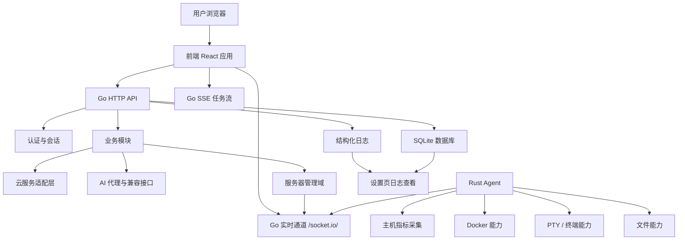

# API Monitor 三端架构治理与清理计划

更新时间：2026-06-16

## 目标

当前项目已经基本完成从 Node 后端迁移到 Go 后端 + Rust Agent 的形态。下一阶段不应继续做大面积“搬代码”，而应进入迁移收口：统一接口契约、修正三端职责边界、补齐可观测性、控制前端性能成本，并清理旧 Node 时代遗留文件。

本计划覆盖三端：

- 前端：React + Vite，负责页面、交互、图表、实时数据展示。
- 后端：Go，负责 API、认证、数据持久化、业务编排、实时通道、静态资源服务。
- Agent：Rust，负责主机指标采集、Docker/PTY/SFTP 等本机能力，以及与 Go 后端保持连接。

明确排除：Music 模块、OpenList 模块不再迁移、不再恢复，只允许作为 `retired` 兼容信息出现在路由清单和防回归测试中。

## 当前架构判断

### 已符合目标架构的部分

- Go 后端已经存在独立入口：`backend-go/cmd/api-monitor/main.go`。
- 后端模块基本按业务域拆分到 `backend-go/internal/*`。
- Rust Agent 已形成独立 crate：`agent-rust/Cargo.toml` + `agent-rust/src/main.rs`。
- 前端已移除 Music 页面，主要页面继续通过 `/api/*` 和 `/socket.io/` 与 Go 后端交互。
- 后端已接入统一日志模块：`backend-go/internal/applog`，并支持 `X-Request-ID`。
- `manifest` 已能表达 Go/Retired 路由归属，可作为迁移验收和前后端对齐的基础。

### 仍不够标准的部分

- Go 后端 `server.ServeHTTP` 和 `manifest.Routes()` 承担过多路由分发细节，后续应拆成更薄的注册层。
- 多个 Go 业务模块以单个 `service.go` 承载大量逻辑，接口深度不够，测试粒度容易被实现细节牵着走。
- 前端页面文件偏大，尤其 Server/Uptime/OpenAI/Gemini 等页面，状态、请求、渲染逻辑混在一起，容易导致卡顿和重复刷新。
- 实时数据链路仍存在历史兼容命名，如 Socket.IO/Engine.IO 兼容层，需用文档和测试固定真实协议行为。
- Rust Agent 旧入口备份文件仍在源码目录，容易误导后续维护者。
- 旧迁移报告散落在根目录和后端目录，影响当前文档入口的可信度。

## 推荐目标架构



### 前端职责

- 只维护 UI 状态、表单状态、页面缓存和用户交互。
- 所有 HTTP 请求统一通过 `src/js/modules/api-client.js` 或领域级 API 模块封装。
- 图表实时数据必须做节流、窗口裁剪和增量更新，避免每 1.5 秒触发整页重渲染。
- 长列表、表格、日志、历史曲线必须有分页、虚拟化或上限窗口。
- 页面组件超过约 800 行时，应优先拆分为 `hooks`、`panels`、`tables`、`charts`、`dialogs`。

### Go 后端职责

- 作为唯一主程序和 API 所有者，不再依赖 Node 后端。
- 每个业务域应拥有清晰的包：路由解析、请求校验、业务逻辑、存储访问、外部适配。
- 所有响应使用统一响应结构和 request id。
- 所有错误路径记录结构化日志，日志字段必须包含模块名、动作、关键资源 id、错误原因。
- 不在业务模块里直接散落 `fmt.Print*` 或默认 `log.*`；统一使用 `applog` 或标准 `slog` 包装。
- 路由归属以 `backend-go/internal/manifest` 为验收源，前端新增接口必须同步 manifest 和测试。

### Rust Agent 职责

- 只负责本机能力和与 Go 后端的 Agent 协议，不承担 UI 业务判断。
- 协议类型集中在 `protocol.rs`，采集逻辑集中在 `collector.rs`，Docker/PTY/文件能力分模块维护。
- Agent 与后端的实时协议必须有兼容测试，尤其是认证、断线重连、心跳、指标批量上报。
- 源码目录只保留当前入口 `main.rs`，历史入口和协议草稿归档到文档，不放在 `src`。

## 前后端接口对齐标准

- `backend-go/internal/manifest/manifest.go` 是接口归属清单。
- `docs/API接口文档.md` 是人工可读接口说明。
- 前端所有 `/api/*`、`/v1/*`、`/socket.io/`、`/ws/*` 调用必须能在 manifest 中找到对应项。
- Music/OpenList 不允许出现在前端导航、页面入口、活跃 API 客户端中。
- Retired 路由返回 `410 Gone` 或明确的不可用响应，不应静默代理或返回假成功。
- 实时指标刷新策略：
  - 初次进入页面加载最近 5 分钟历史数据。
  - 后续通过实时通道增量追加。
  - 图表窗口保持最近 5 分钟。
  - UI 渲染节流，不把采集间隔直接等同于 React render 间隔。

## 日志与排障标准

- 后端日志：JSON Lines，输出到 stdout 和 `data/logs/app.log`。
- HTTP 请求日志必须包含：`request_id`、method、path、status、duration_ms、remote_addr。
- 业务日志必须包含：module、action、resource id、错误信息。
- 前端开发日志建议统一封装，生产构建避免无控制的 `console.log`。
- Rust Agent 后续建议接入 `tracing`，字段包含 server_id、session_id、事件类型、重连次数。
- 设置页日志读取和清理必须与 Go 实际日志路径一致。

## 性能治理标准

### 前端

- Server 图表只保留最近 5 分钟窗口，避免无界数组。
- 实时事件进入内存缓存后批量刷新 React 状态，建议 800-1500ms 合并一次。
- 大页面拆分后使用 memo、selector、局部状态，减少全页重渲染。
- 图表组件避免在每次 render 重建大对象和事件处理器。
- 构建后用浏览器 Performance 面板确认长任务来源。

### Go 后端

- 高频指标写入应批量化或限制写入频率。
- 数据库查询必须有时间范围、分页或 limit。
- 外部 API 调用必须设置 timeout。
- 长任务使用 context 取消，不阻塞 HTTP 主路径。
- WebSocket/Engine.IO 连接需要连接数、最后心跳、失败原因日志。

### Rust Agent

- 指标采集间隔与上报间隔分离，避免慢采集拖住实时链路。
- Docker 和 GPU 等可选能力失败时降级，不阻塞基础指标。
- 断线重连使用退避策略，避免后端重启时形成连接风暴。

## 目录结构目标

### 当前保留目录

```text
backend-go/         Go 后端主程序
agent-rust/         Rust Agent
src/                前端源码
public/             静态资源
docs/               当前维护文档
docs/archive/       历史迁移、测试、排障报告
scripts/            开发和启动脚本
data/               本地运行数据，不进入版本控制
```

### 应逐步退出的目录或文件

- `modules/`：Node 后端旧模块，迁移完成后应删除或保持 git 删除状态。
- `server.js`、`src/routes/*`、`src/middleware/*`、`src/services/*`、`src/db/*`：Node 后端遗留路径。
- `plugin/`：如浏览器插件不再维护，应归档或删除。
- 根目录迁移报告：统一移动到 `docs/archive/`。
- `backend-go/*.md` 中的一次性修复报告：统一移动到 `docs/archive/`。
- `agent-rust/src/main_*.rs`、`*.backup`：旧入口，不应留在源码目录。

## 分阶段实施计划

### P0：迁移收口和遗留清理

- 清理未引用的 Agent 旧入口文件。
- 清理前端 Socket.IO 临时测试 HTML。
- 将根目录和 `backend-go` 下的一次性迁移报告归档到 `docs/archive/`。
- 保留 `backend-go/api-monitor.exe`，因为当前启动脚本仍引用它；后续如要完全改为构建产物目录，再统一调整脚本。

### P1：接口契约治理

- 为 manifest 增加前端调用覆盖检查。
- 从前端扫描 `/api`、`/v1`、`/socket.io`、`/ws` 调用，生成接口清单。
- 对比 Go manifest，修复缺失、误标 retired、权限不一致的接口。
- 更新 `docs/API接口文档.md`。

### P2：后端 Go 规范化

- 将 `server.ServeHTTP` 中的大 switch 拆成路由注册表或每域注册函数。
- 对超大 `service.go` 拆分为 handler、store、domain、adapter。
- 为关键模块增加 table-driven tests。
- 统一 context timeout、错误包装、日志字段。
- 删除 legacy proxy 概念和 Node owner 残留，除非仅用于历史 manifest 测试。

### P3：前端性能和结构治理

- ServerPage 拆分为数据 hook、图表组件、表格组件、弹窗组件、操作模块。
- Uptime/OpenAI/Gemini 等大页面按同样方式拆分。
- 为实时数据增加性能预算：单次批处理耗时、图表点数上限、render 次数上限。
- 将重复的 fetch/cache/toast/dialog 模式抽到领域 API 模块。

### P4：Rust Agent 稳定性

- 引入 `tracing` 和结构化日志。
- 增加协议兼容测试和断线重连测试。
- 将平台特定能力拆到更明确的模块。
- 增加 release profile 和交叉编译说明。

## 验收清单

- `npm run lint` 通过。
- `npm run build` 通过。
- `cd backend-go && go test ./...` 通过。
- `cd agent-rust && cargo check` 通过。
- 前端所有活跃页面没有 Music/OpenList 入口。
- 前端接口调用均能在 Go manifest 中找到活跃或明确 retired 的归属。
- Server 页面刷新后展示最近 5 分钟历史数据，并继续增量更新。
- 设置页能读取 Go 后端当前日志文件。
- 后端关键错误都有 request id，可从前端错误响应追到日志。
- 清理后的根目录只保留当前维护文档，历史报告进入 `docs/archive/`。

## 本轮高置信清理范围

本轮只处理不会影响业务运行的文件：

- 删除 `agent-rust/src/main.rs.backup`。
- 删除 `agent-rust/src/main_new.rs`。
- 删除 `agent-rust/src/main_old_protocol.rs`。
- 删除 `src/test-socket.html`。
- 归档根目录迁移/诊断报告到 `docs/archive/`。
- 归档 `backend-go` 下的一次性修复报告到 `docs/archive/`。

不处理：

- 不删除 `backend-go/api-monitor.exe`，因为脚本仍引用。
- 不恢复 Music/OpenList。
- 不回滚已经删除的 Node 后端文件。
- 不改动用户迁移中的大面积业务实现。

## 本轮执行记录

执行时间：2026-06-16

已完成：

- 确认 `agent-rust/src` 仅保留当前入口 `main.rs`，旧入口 `main.rs.backup`、`main_new.rs`、`main_old_protocol.rs` 已不在源码目录。
- 确认前端 Socket.IO 临时测试文件 `src/test-socket.html` 已清理。
- 确认根目录和 `backend-go` 下未继续保留一次性迁移/修复 Markdown 报告。
- 补强 `tools/three-side-governance-check.mjs`，将前端调用覆盖、退休模块引用、旧文件残留、生产流程脚本引用纳入 `npm run governance:check`。
- 将 Server 页面旧 `/ws/ssh` Node WebSocket 入口改为明确的退役提示，不再发起已 retired 的活跃连接。
- 保留 `backend-go/api-monitor.exe` 的脚本兼容策略，未做删除。

验收结果：

- `npm run governance:check` 通过，当前 manifest 可解析路由数：152。
- `npm run lint` 通过。
- `npm run build` 通过。
- `cd backend-go && go test ./...` 通过。
- `cd agent-rust && cargo check` 通过；仍有 `SocketIOMessage.NamespaceConnect` 未构造的既有 dead_code 警告，后续可在 Agent 协议测试补齐时处理。
