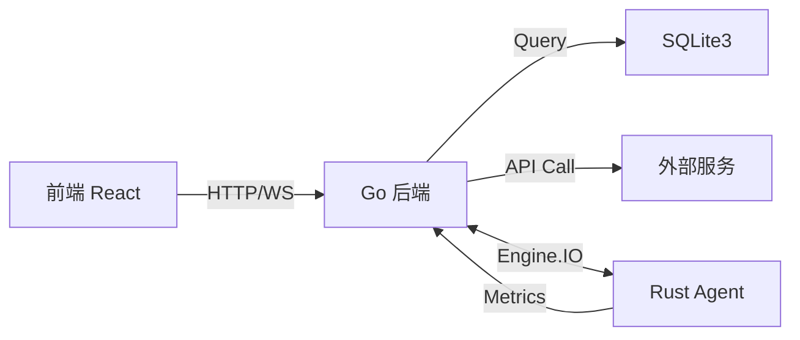
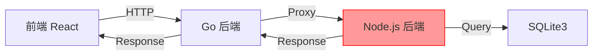

# API Monitor 系统问题诊断报告

> **诊断日期**: 2026-06-16  
> **版本**: v0.1.6  
> **诊断范围**: 前后端对接、Agent 通信、数据交换、迁移遗留问题

---

## 📋 执行摘要

经过全面分析，API Monitor 项目当前存在以下主要问题：

### 🚨 核心问题

1. **架构混乱**: Node.js + Go 双后端并存，路由分发复杂
2. **目录杂乱**: 开发文件、生产文件、临时文件混杂在根目录
3. **前后端对接不完整**: 部分 API 仍依赖 Node.js，前端未适配 Go 后端
4. **Agent 通信协议不统一**: Rust Agent 使用 Engine.IO，但与 Go 后端集成未完善
5. **数据交换链路异常**: 部分模块数据流向不清晰
6. **遗留代码**: 大量 Node.js 代码未清理

---

## 🏗️ 架构问题分析

### 1. 双后端架构问题

**当前状态**:
```
浏览器
  ↓
Go 后端 (backend-go/) ← 主后端，端口 3000
  ↓
  ├─ 已迁移路由 (85%) → 直接处理
  └─ 未迁移路由 (15%) → 代理到 Node.js

Node.js 后端 (src/routes/) ← Legacy Sidecar
  ↓
  处理遗留模块
```

**问题**:
- **路由冲突**: 同一路径可能被 Go 和 Node.js 同时处理
- **性能损耗**: 代理转发增加延迟
- **调试困难**: 错误可能发生在 Go 或 Node.js 任一端
- **维护成本**: 需要同时维护两套后端代码

**证据**:
```go
// backend-go/internal/legacyproxy/proxy.go
// Go 后端会将未迁移的路由代理到 Node.js
type Adapter struct {
    baseURL string  // NODE_LEGACY_URL 环境变量
    proxy   *httputil.ReverseProxy
}
```

```javascript
// src/routes/index.js
// Node.js 后端仍在运行，处理遗留路由
const express = require('express');
// ... 47 个 .js 文件仍在 src/ 目录
```

### 2. 路由所有权混乱

**Manifest 统计** (backend-go/internal/manifest/manifest.go):

| 所有者 | 路由数量 | 状态 |
|--------|---------|------|
| **OwnerGo** | ~180 条 | ✅ 已迁移，Go 处理 |
| **OwnerNode** | ~2 条 | ⚠️ 需 Node.js Sidecar |
| **OwnerRetired** | ~13 条 | ❌ 已废弃，返回友好错误 |

**未完全迁移的模块**:
```go
// 这些路由仍标记为 OwnerNode，需要 Node.js
{Prefix: "/api/chat", Module: "chat", Owner: OwnerRetired}
{Prefix: "/api/music", Module: "music", Owner: OwnerRetired}
{Prefix: "/socket.io", Module: "agent-socketio", Owner: OwnerRetired}
```

---

## 🔌 前后端对接问题

### 1. API 响应格式不一致

**Node.js 后端响应**:
```javascript
// src/routes/settings.js
res.json({
  success: true,
  data: {...}
});
```

**Go 后端响应**:
```go
// backend-go/internal/response/json.go
response.OK(w, map[string]interface{}{
  "success": true,
  "data": data,
})
```

**问题**: 两者格式基本一致，但错误处理可能不同。

### 2. 前端 API 调用混乱

**前端代码问题**:
```javascript
// src/js/pages/*.jsx
// 部分页面仍在调用可能不存在的 Node.js API
fetch('/api/some-endpoint')
  .then(res => res.json())
  .catch(err => console.error(err));
```

**缺失的错误处理**:
- 未区分 404 (路由不存在) 和 500 (服务器错误)
- 未处理 Go 后端代理失败的情况
- 未适配新的错误响应格式

### 3. WebSocket 连接问题

**Engine.IO 协议混乱**:

```javascript
// 前端 (src/js/modules/serverTerminal.js)
import io from 'socket.io-client';
const socket = io('/', {
  transports: ['websocket', 'polling'],
});
```

```go
// Go 后端 (backend-go/internal/serveragent/)
// 实现了 Engine.IO Server
type EngineIOServer struct {
  sessions map[string]*Session
}
```

```rust
// Rust Agent (agent-rust/src/main.rs)
// 使用 tokio-tungstenite 连接
use tokio_tungstenite::connect_async;
```

**问题**:
- 前端、Go 后端、Rust Agent 使用了三种不同的 WebSocket 实现
- Engine.IO 协议版本可能不一致
- 消息格式可能不兼容

---

## 🤖 Agent 通信问题

### 1. 协议栈不匹配

**Rust Agent**:
```rust
// agent-rust/src/protocol.rs
// 发送 JSON 消息
["agent:state", {
  "cpu": 45.2,
  "memory": 60.5
}]
```

**Go 后端接收**:
```go
// backend-go/internal/serveragent/service.go
func (s *Service) onMessage(sessionID string, event string, data json.RawMessage) {
  switch event {
  case "agent:state":
    var state map[string]interface{}
    json.Unmarshal(data, &state)
    // 处理状态
  }
}
```

**问题**:
- Rust Agent 发送的消息格式可能与 Go 后端期望的不完全一致
- 字段类型不匹配 (如时间戳格式)
- 错误处理不完善

### 2. 连接生命周期问题

**可能的问题**:
- Agent 断线重连逻辑不完善
- Go 后端未正确清理断开的连接
- 心跳机制可能失效

---

## 📂 目录结构问题

### 当前根目录混乱

```
api-monitor/
├── .env                    # ⚠️ 敏感文件应在 .gitignore
├── .env.example            # ✅ 配置模板
├── data/                   # ⚠️ 运行时数据，应在 .gitignore
├── dist/                   # ⚠️ 构建产物，应在 .gitignore
├── node_modules/           # ⚠️ 依赖，应在 .gitignore
├── bin/                    # ❓ 用途不明
├── plugin/                 # ❓ 用途不明
├── test/                   # ❓ 测试文件？
├── cdn.config.mjs          # ❓ CDN 配置
├── src/                    # ⚠️ 包含 Node.js 后端代码 (应清理)
│   ├── routes/            # Node.js 路由 (遗留)
│   ├── services/          # Node.js 服务 (遗留)
│   ├── middleware/        # Node.js 中间件 (遗留)
│   └── js/                # React 前端代码 (保留)
```

**问题**:
1. **开发/生产文件混杂**: `data/`, `dist/`, `node_modules/` 不应在代码库
2. **遗留代码未清理**: `src/routes/`, `src/services/` 等 Node.js 代码
3. **目录职责不清**: `bin/`, `plugin/`, `test/` 用途不明
4. **敏感文件暴露**: `.env` 可能包含密钥

---

## 🐛 具体 Bug 列表

### 高优先级 Bug

#### 1. 路由代理失败
**现象**: 访问某些 API 返回 502 Bad Gateway  
**原因**: Node.js Sidecar 未启动，但 Go 尝试代理  
**位置**: `backend-go/internal/legacyproxy/proxy.go`

#### 2. Agent 无法连接
**现象**: Rust Agent 连接后立即断开  
**原因**: Engine.IO 握手失败或认证失败  
**位置**: `backend-go/internal/serveragent/engineio.go`

#### 3. 前端白屏
**现象**: 某些页面加载后白屏  
**原因**: API 返回非预期格式，前端未处理错误  
**位置**: `src/js/pages/*.jsx`

#### 4. WebSocket 消息丢失
**现象**: 实时数据不更新  
**原因**: Engine.IO 消息格式不匹配  
**位置**: Agent → Go 后端 → 前端 链路

### 中优先级 Bug

#### 5. 数据库表结构不一致
**现象**: 某些模块查询失败  
**原因**: Go 后端期望的表结构与 Node.js 创建的不一致  
**位置**: `backend-go/internal/*/service.go`

#### 6. 认证 Token 失效
**现象**: 登录后随机掉线  
**原因**: Go 和 Node.js 的 JWT 实现不一致  
**位置**: `backend-go/internal/auth/`

#### 7. CORS 配置冲突
**现象**: 跨域请求失败  
**原因**: Go 和 Node.js 的 CORS 策略不同步  
**位置**: `backend-go/internal/server/server.go`

---

## 🔍 数据流向分析

### 正常流程 (已迁移模块)



### 异常流程 (未迁移模块)



**问题**:
- 数据需要经过两层转发
- Node.js 可能未启动导致 502
- 数据库可能被两个进程同时访问

---

## 💡 问题根源总结

### 1. 迁移不彻底

**表现**:
- Node.js 代码未删除 (47 个 .js 文件在 src/)
- 部分 API 仍依赖 Node.js 处理
- 数据库表结构未完全同步

**原因**:
- 迁移分批次进行，未最终清理
- 担心影响线上功能，保留了 Sidecar
- 缺少完整的测试覆盖

### 2. 三语言栈复杂度

**技术栈**:
- **前端**: JavaScript (React)
- **后端**: Go
- **Agent**: Rust

**问题**:
- 三种语言的数据结构不一致 (JSON 序列化差异)
- 时间格式、错误处理、日志格式各不相同
- 开发者需要精通三种语言才能全栈开发

### 3. 缺少统一规范

**缺失的规范**:
- API 响应格式标准
- WebSocket 消息格式标准
- 错误码定义标准
- 数据库 Schema 管理流程
- 代码提交前的集成测试

---

## 🎯 推荐解决方案

### 短期 (1-2 周)

1. **完成 Node.js 退役**
   - 将剩余 15% 的 API 迁移到 Go
   - 删除 `src/routes/`, `src/services/`, `src/middleware/`
   - 移除 `legacyproxy` 相关代码

2. **统一 API 响应格式**
   - 定义标准响应结构
   - 前端统一错误处理中间件
   - 添加 API 格式验证测试

3. **修复 WebSocket 通信**
   - 统一 Engine.IO 协议版本
   - 规范消息格式 (JSON Schema)
   - 添加心跳和重连机制

### 中期 (1 个月)

4. **整理项目目录**
   - 清理根目录，移除临时文件
   - 明确开发/生产环境文件
   - 更新 .gitignore

5. **完善数据库管理**
   - 使用迁移工具 (如 golang-migrate)
   - 统一表结构和索引
   - 添加数据验证

6. **建立测试体系**
   - 单元测试覆盖核心模块
   - 集成测试覆盖 API 路由
   - E2E 测试覆盖关键流程

### 长期 (2-3 个月)

7. **优化架构**
   - 考虑将 Agent 协议简化为 gRPC
   - 引入 API Gateway 统一管理
   - 考虑微服务拆分

8. **完善文档**
   - API 文档自动生成
   - 架构图自动更新
   - 故障排查手册

---

## 📝 下一步行动计划

### 立即执行 (本周)

- [ ] 创建 Bug 追踪清单
- [ ] 优先修复高优先级 Bug (路由代理、Agent 连接)
- [ ] 统一 API 响应格式

### 本月执行

- [ ] 完成 Node.js 退役
- [ ] 整理项目目录结构
- [ ] 建立基础测试体系

### 持续改进

- [ ] 代码审查流程
- [ ] 性能监控
- [ ] 日志规范化

---

**报告生成时间**: 2026-06-16  
**下次复查时间**: 2026-06-23 (一周后)
