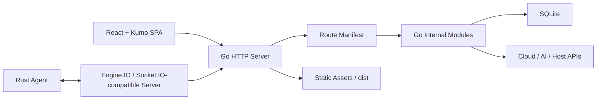

# API Monitor 设计文档

最后更新：2026-09-08

API Monitor 是一个单体模块化的 API 管理、云服务管理与主机监控面板。当前技术主线是 **React 19 + Kumo 2.13.1 + Zustand + Go Manifest Backend + SQLite + Rust Agent**。

## 架构概览

系统由四个主要部分组成：

1. 前端层：`src/js/`，React 单页应用，使用 Kumo 作为唯一基础 UI 设计系统。
2. 后端层：`backend-go/`，Go 单进程后端，负责认证、API、静态资源、实时通信和业务模块调度。
3. 数据层：SQLite，作为唯一持久化数据库，运行时数据位于被忽略的数据目录。
4. Agent 层：`agent-rust/`，Rust 主机 Agent，负责指标、Docker、终端和文件能力。



## 前端层

React 入口位于 `src/js/main.jsx`。应用壳层由 `src/js/components/MainLayout.jsx` 负责，页面位于 `src/js/pages/`，全局状态位于 `src/js/store.js`。

前端核心约束：

- 基础控件、弹窗、表格、通知、图表和加载态优先使用 Kumo。
- 页面可以写业务布局、数据适配和 hooks，但不要新增通用自绘 UI 组件。
- 删除确认逐步迁移到 `dialog.deleteResource` / Kumo `DeleteResource`。
- 图表优先使用 Kumo `TimeseriesChart`、`Meter` 和 `ChartPalette`。
- 允许例外必须记录在 `docs/重构验证与例外清单.md`。

详细规则见 [Kumo UI 规则](./Kumo UI 规则.md)。

## 后端层

Go 后端位于 `backend-go/`，主入口是 `backend-go/cmd/api-monitor`。当前路由治理以 `backend-go/internal/manifest/manifest.go` 为源头，路由条目记录：

- URL 前缀或模式。
- 业务模块名。
- 路由 owner。
- 认证模式。
- 响应模式。
- 匹配模式。

后端新增或修改路由时，必须同步更新 manifest，并运行：

```bash
npm run governance:check
node tools/backend-route-inventory.mjs
npm run backend-go:test
```

核心后端区域：

- `backend-go/internal/server`：HTTP 服务、静态资源、路由分发、实时入口。
- `backend-go/internal/manifest`：路由清单与治理基线。
- `backend-go/internal/auth`：登录、会话、2FA。
- `backend-go/internal/settings`：系统设置、数据库维护、导入导出。
- `backend-go/internal/serveragent`：Rust Agent 连接、主机指标、终端、Docker、文件能力。
- `backend-go/internal/cloudflare`、`openai`、`filebox`、`uptime`、`notification` 等业务模块。

旧 Express / `modules/*-api` 结构不再是新增功能的默认模型。

## 数据层

SQLite 是当前唯一持久化数据库。配置、账号、密钥、监控数据、日志和模块状态都应通过 Go 后端的数据访问层维护。

数据保护规则：

- 不默认删除 `.env`、`data/`、`backup/`、`backend-go/data/`、`backend-go/internal/server/data/`。
- 不把真实 Token、Cookie、私钥、数据库、备份或上传文件写入文档或测试夹具。
- 清理目录时只删除可再生成的缓存、构建产物和临时 trace/test 文件。

## Agent 层

Rust Agent 位于 `agent-rust/`。它通过 Go 后端的 Engine.IO/Socket.IO-compatible 通道上报指标，并提供 Docker、终端、文件管理等能力。

高风险区域：

- Rust Agent 协议字段。
- `backend-go/internal/serveragent/service.go`。
- 终端 PTY、Docker 操作和破坏性主机动作。

修改这些区域时必须保持前后端协议兼容，并优先补充端到端 smoke 或 Go/Rust 单元测试。

## 治理与维护

固定治理命令：

```bash
npm run audit:fast
npm run clean:check
```

完整检查命令：

```bash
npm run audit:full
```

`audit:full` 包含 `backend-go:smoke`，需要一个正在运行的 Go 后端；默认地址是 `http://127.0.0.1:3000`，也可通过 `API_MONITOR_BASE_URL` 指定。

目录清理只通过 `tools/workspace-cleanup.mjs` 的 allowlist 进行。`public/` 虽然被忽略，但可能参与静态资源或部署流程，必须确认后再处理。

## 当前风险

- `ServerPage.jsx`、`DnsPage.jsx`、`OpenAIPage.jsx` 仍是高复杂页面，只在相关需求中渐进拆分。
- 部分旧 ECharts 配色保留为例外，触碰相关图表时再迁移到 Kumo Chart。
- 删除确认仍有渐进迁移空间，触碰删除流时优先改为 `DeleteResource`。
- 真实云厂商、Agent、SSH/SFTP、Docker 和外部 AI API 场景仍依赖真实环境回归。
