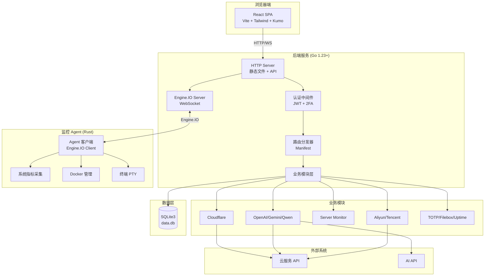
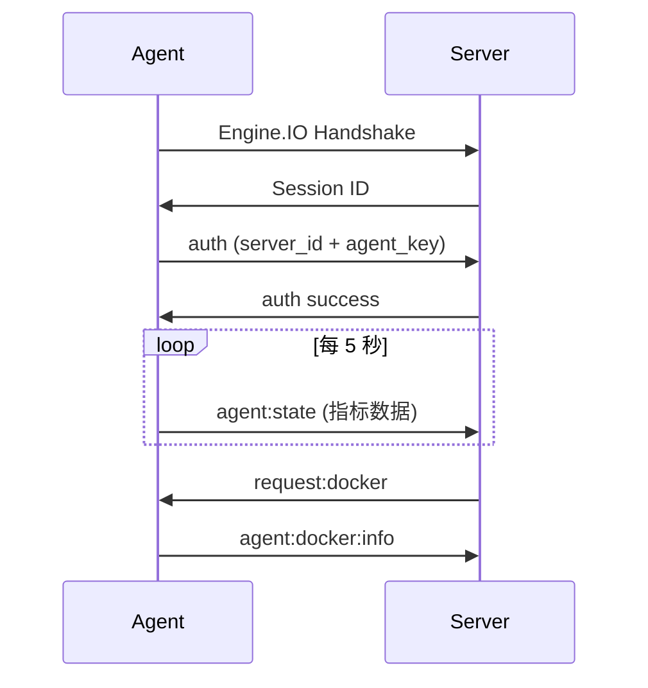

# API Monitor 项目架构与技术详解

> **最后更新**: 2026-06-16  
> **版本**: v2.0.0  
> **文档作者**: Claude Code

---

## 📋 目录

1. [项目概览](#项目概览)
2. [技术栈总览](#技术栈总览)
3. [架构设计](#架构设计)
4. [核心模块详解](#核心模块详解)
5. [前端架构](#前端架构)
6. [后端架构](#后端架构)
7. [Agent 架构](#agent-架构)
8. [数据存储](#数据存储)
9. [部署方案](#部署方案)
10. [开发指南](#开发指南)

---

## 项目概览

### 🎯 核心定位

API Monitor 是一个**全能型的 API 管理与服务器监控面板**，集成了以下核心能力：

- **🤖 AI API 网关**: OpenAI、Gemini CLI、通义千问 API 代理与管理
- **☁️ 云服务管理**: Cloudflare DNS/Workers/Pages、阿里云、腾讯云、Koyeb、Fly.io
- **🖥️ 主机监控**: 实时终端、Docker 管理、系统指标监控
- **🔧 工具箱**: TOTP 双因子认证、文件分享、可用性监测、通知系统

### 📊 项目规模

```
总代码行数: ~50,000+ 行
├── 后端 (Go): ~15,000 行
├── 前端 (React): ~25,000 行
├── Agent (Rust): ~3,000 行
└── 文档与配置: ~7,000 行
```

### 🏗️ 架构演进

**当前阶段**: 正在进行 **Node.js → Go 后端迁移**

- **已完成**: 85% 的 API 路由已迁移至 Go
- **进行中**: Rust Agent 与 Go 后端 Engine.IO 集成
- **计划中**: 完全退役 Node.js sidecar

---

## 技术栈总览

### 后端技术栈

| 技术 | 版本 | 用途 |
|------|------|------|
| **Go** | 1.23+ | 主后端服务 |
| **SQLite3** | - | 数据持久化 (modernc.org/sqlite) |
| **Gorilla WebSocket** | 1.5.3 | WebSocket 连接 |
| **gopsutil** | v4.24.12 | 系统指标采集 |
| **bcrypt** | golang.org/x/crypto | 密码加密 |
| **robfig/cron** | v3.0.1 | 定时任务调度 |

### 前端技术栈

| 技术 | 版本 | 用途 |
|------|------|------|
| **React** | 19.2.7 | UI 框架 |
| **Vite** | 7.3.0 | 构建工具 |
| **Tailwind CSS** | 4.3.0 | 样式框架 |
| **Zustand** | 5.0.14 | 状态管理 |
| **@cloudflare/kumo** | 2.5.0 | 组件库 |
| **xterm.js** | 5.5.0 | 终端模拟器 |
| **ECharts** | 6.1.0 | 数据可视化 |
| **Socket.IO Client** | 4.8.3 | 实时通信 |

### Agent 技术栈

| 技术 | 版本 | 用途 |
|------|------|------|
| **Rust** | 2021 Edition | Agent 开发语言 |
| **Tokio** | 1.38 | 异步运行时 |
| **tokio-tungstenite** | 0.26 | WebSocket 客户端 |
| **sysinfo** | 0.31 | 系统信息采集 |
| **bollard** | 0.16 | Docker API 客户端 |
| **portable-pty** | 0.8 | PTY 终端实现 |

---

## 架构设计

### 系统整体架构



### 核心设计原则

1. **模块化分层**: 核心层 → 模块层 → 前端层
2. **单一数据源**: SQLite 作为唯一持久化存储
3. **渐进式迁移**: Go 逐步替换 Node.js，保持向后兼容
4. **安全优先**: JWT 会话、bcrypt 密码、CORS 控制
5. **实时通信**: Engine.IO/Socket.IO 双向通信

---

## 核心模块详解

### 1. 认证与授权模块 (Auth)

**位置**: `backend-go/internal/auth/`

**核心功能**:
- 管理员密码验证 (bcrypt 加密)
- JWT 会话管理
- TOTP 双因子认证 (2FA)
- 登录速率限制

**关键 API**:
```
POST /api/auth/login          # 登录
POST /api/auth/logout         # 登出
GET  /api/auth/session        # 会话验证
GET  /api/auth/check-password # 检查密码设置
POST /api/auth/2fa            # 2FA 设置
GET  /api/auth/2fa/status     # 2FA 状态
```

**数据表**:
```sql
CREATE TABLE system_settings (
  key TEXT PRIMARY KEY,
  value TEXT,
  created_at DATETIME DEFAULT CURRENT_TIMESTAMP,
  updated_at DATETIME DEFAULT CURRENT_TIMESTAMP
);
-- 存储: admin_password_hash, jwt_secret, totp_secret
```

### 2. Cloudflare 管理模块

**位置**: `backend-go/internal/cloudflare/`

**核心功能**:
- 多账号管理 (Token 加密存储)
- DNS 记录批量操作
- Workers 脚本部署与监控
- Pages 项目管理
- R2 对象存储
- Cloudflare Tunnel

**关键 API**:
```
GET    /api/cloudflare/accounts           # 账号列表
POST   /api/cloudflare/accounts           # 创建账号
PUT    /api/cloudflare/accounts/{id}      # 更新账号
DELETE /api/cloudflare/accounts/{id}      # 删除账号
GET    /api/cloudflare/zones              # 域名列表
POST   /api/cloudflare/accounts/{id}/zones/{zoneId}/records  # 创建 DNS 记录
```

**数据表**:
```sql
CREATE TABLE cloudflare_accounts (
  id INTEGER PRIMARY KEY,
  name TEXT NOT NULL,
  email TEXT,
  api_token_encrypted TEXT NOT NULL,
  account_id TEXT,
  created_at DATETIME DEFAULT CURRENT_TIMESTAMP
);

CREATE TABLE cloudflare_dns_templates (
  id INTEGER PRIMARY KEY,
  name TEXT NOT NULL,
  records TEXT NOT NULL,  -- JSON array
  created_at DATETIME DEFAULT CURRENT_TIMESTAMP
);
```

### 3. Server Agent 模块

**位置**: `backend-go/internal/serveragent/`

**核心功能**:
- Engine.IO 服务器 (Agent 连接管理)
- 实时指标接收与存储
- Docker 容器管理
- 终端 PTY 会话
- SSH/SFTP 文件管理

**关键 API**:
```
GET    /socket.io/               # Engine.IO 握手
POST   /api/server/accounts      # 服务器列表
GET    /api/server/s/{id}        # 服务器详情
POST   /api/server/action        # 服务器操作 (重启/关机)
GET    /api/server/metrics/latest/{id}  # 最新指标
```

**数据表**:
```sql
CREATE TABLE server_accounts (
  id INTEGER PRIMARY KEY,
  name TEXT NOT NULL,
  host TEXT NOT NULL,
  port INTEGER DEFAULT 22,
  status TEXT DEFAULT 'offline',  -- online/offline/error
  agent_connected BOOLEAN DEFAULT 0,
  last_check_time DATETIME
);

CREATE TABLE server_metrics_history (
  id INTEGER PRIMARY KEY,
  server_id INTEGER,
  cpu_usage REAL,
  memory_usage REAL,
  disk_usage REAL,
  network_rx BIGINT,
  network_tx BIGINT,
  timestamp DATETIME DEFAULT CURRENT_TIMESTAMP
);
```

### 4. AI API 代理模块

**位置**: 
- `backend-go/internal/openai/`
- `backend-go/internal/geminicli/`
- `backend-go/internal/qwen/`

**核心功能**:
- OpenAI 兼容 API 端点管理
- Gemini CLI 转 OpenAI 格式
- 通义千问图像生成
- 请求日志与额度统计
- 模型列表聚合

**关键 API**:
```
GET  /v1/models                  # 聚合模型列表
POST /v1/chat/completions        # 聊天完成 (支持流式)
POST /v1/images/generations      # 图像生成
GET  /api/openai                 # OpenAI 端点列表
POST /api/gemini-cli             # Gemini CLI 配置
```

**数据表**:
```sql
CREATE TABLE openai_endpoints (
  id INTEGER PRIMARY KEY,
  name TEXT NOT NULL,
  base_url TEXT NOT NULL,
  api_key_encrypted TEXT,
  enabled BOOLEAN DEFAULT 1
);

CREATE TABLE openai_logs (
  id INTEGER PRIMARY KEY,
  endpoint_id INTEGER,
  model TEXT,
  prompt_tokens INTEGER,
  completion_tokens INTEGER,
  total_cost REAL,
  timestamp DATETIME DEFAULT CURRENT_TIMESTAMP
);
```

### 5. 工具箱模块

#### TOTP (双因子认证)

**位置**: `backend-go/internal/totp/`

**核心功能**:
- TOTP/HOTP 密钥管理
- 二维码生成
- 自动复制与倒计时

**数据表**:
```sql
CREATE TABLE totp_items (
  id INTEGER PRIMARY KEY,
  name TEXT NOT NULL,
  secret TEXT NOT NULL,
  issuer TEXT,
  account TEXT,
  type TEXT DEFAULT 'totp',  -- totp/hotp
  counter INTEGER DEFAULT 0
);
```

#### Filebox (文件分享)

**位置**: `backend-go/internal/filebox/`

**核心功能**:
- 临时文件上传
- 密码保护
- 过期自动清理

#### Uptime (可用性监测)

**位置**: `backend-go/internal/uptime/`

**核心功能**:
- HTTP/HTTPS/TCP/ICMP 监测
- 定时检查与告警
- 公开状态页
- Push 监测支持

**数据表**:
```sql
CREATE TABLE uptime_monitors (
  id INTEGER PRIMARY KEY,
  name TEXT NOT NULL,
  type TEXT NOT NULL,  -- http/tcp/ping/push
  url TEXT,
  interval INTEGER DEFAULT 60,
  enabled BOOLEAN DEFAULT 1
);

CREATE TABLE uptime_heartbeats (
  id INTEGER PRIMARY KEY,
  monitor_id INTEGER,
  status TEXT,  -- up/down
  response_time INTEGER,
  timestamp DATETIME DEFAULT CURRENT_TIMESTAMP
);
```

#### Notification (通知系统)

**位置**: `backend-go/internal/notification/`

**核心功能**:
- 多通道支持 (Webhook、邮件、企业微信)
- 告警规则配置
- 通知历史

---

## 前端架构

### 组件结构

```
src/js/
├── main.jsx                    # 应用入口
├── App.jsx                     # 根组件
├── store.js                    # Zustand 全局状态
├── components/
│   ├── MainLayout.jsx          # 主布局 (Kumo Sidebar)
│   ├── AppPageHeader.jsx       # 页面头部
│   ├── AnimatedCollapse.jsx    # 折叠动画
│   ├── GlobalDialogHost.jsx    # 全局弹窗
│   └── ui/                     # UI 基础组件
├── pages/                      # 页面组件
│   ├── DashboardPage.jsx       # 仪表盘
│   ├── ServerPage.jsx          # 服务器管理
│   ├── DnsPage.jsx             # Cloudflare DNS
│   ├── OpenAIPage.jsx          # OpenAI 管理
│   └── ...
└── modules/                    # 业务模块
    ├── dialog.js               # 弹窗管理
    ├── toast.js                # 消息提示
    ├── serverTerminal.js       # 终端模块
    └── utils.js                # 工具函数
```

### 状态管理 (Zustand)

**核心状态**:

```javascript
{
  // 认证状态
  isAuthenticated: false,
  showLoginModal: false,
  loginPassword: '',
  
  // UI 状态
  mainActiveTab: 'dashboard',
  sidebarCollapsed: false,
  themeMode: 'auto',  // auto/light/dark
  pageWidthMode: 'standard',  // standard/wide/full
  
  // 模块配置
  moduleVisibility: {...},
  moduleOrder: [...],
  
  // 用户设置
  customCss: '',
  totpSettings: {...},
  agentDownloadUrl: ''
}
```

### 路由系统

**路由映射**:

```javascript
const MODULE_CONFIG = {
  dashboard: { name: '仪表盘', icon: 'fa-tachometer-alt' },
  server: { name: '主机实例', icon: 'fa-server' },
  dns: { name: 'Cloudflare', icon: 'fa-globe' },
  openai: { name: 'OpenAI', icon: 'fa-robot' },
  // ...
};
```

**URL 结构**: `/#/{moduleId}`

例如: `/#/server`, `/#/dns`, `/#/openai`

### UI 设计规范

1. **基础组件**: 必须使用 Kumo 组件库
2. **表格**: `Kumo Table` + `ResizeHandle`
3. **图表**: `Kumo TimeseriesChart` / `Meter`
4. **主题**: 支持 auto/light/dark 三种模式
5. **响应式**: 页面宽度支持 standard/wide/full

---

## 后端架构

### Go 后端结构

```
backend-go/
├── cmd/
│   └── api-monitor/
│       └── main.go              # 主入口
├── internal/
│   ├── server/
│   │   └── server.go            # HTTP 服务器
│   ├── manifest/
│   │   └── manifest.go          # 路由注册表
│   ├── config/
│   │   └── config.go            # 配置加载
│   ├── database/
│   │   └── database.go          # SQLite 封装
│   ├── auth/                    # 认证模块
│   ├── cloudflare/              # Cloudflare 模块
│   ├── serveragent/             # Agent 服务器
│   ├── openai/                  # OpenAI 模块
│   ├── geminicli/               # Gemini CLI
│   ├── qwen/                    # 通义千问
│   ├── aliyun/                  # 阿里云
│   ├── tencent/                 # 腾讯云
│   ├── koyeb/                   # Koyeb
│   ├── flyio/                   # Fly.io
│   ├── totp/                    # TOTP
│   ├── filebox/                 # 文件箱
│   ├── uptime/                  # 可用性监测
│   ├── notification/            # 通知系统
│   ├── cronjobs/                # 定时任务
│   └── settings/                # 设置管理
└── go.mod
```

### 路由分发机制

**Manifest 系统**:

每个路由定义包含:
- `Prefix`: URL 前缀
- `Module`: 模块名称
- `Owner`: 所有者 (go/node/retired)
- `Auth`: 认证模式 (public/session/api_key/agent_key)
- `ResponseMode`: 响应类型 (json/stream/websocket)
- `MatchMode`: 匹配模式 (prefix/exact/pattern)

**示例**:

```go
{
  Prefix: "/api/cloudflare/accounts/{id}",
  Module: "cloudflare-accounts",
  Owner: OwnerGo,
  Auth: AuthSession,
  ResponseMode: ResponseJSON,
  MatchMode: MatchPattern,
}
```

### 数据库设计

**核心表**:

1. **system_settings**: 系统配置 (密码、密钥、2FA)
2. **cloudflare_accounts**: Cloudflare 账号
3. **server_accounts**: 服务器实例
4. **server_metrics_history**: 指标历史
5. **openai_endpoints**: OpenAI 端点
6. **totp_items**: TOTP 密钥
7. **uptime_monitors**: 监测任务
8. **notification_channels**: 通知渠道

**加密存储**: 
- 使用 `secure` 包对敏感数据加密
- AES-256-GCM 加密算法
- 密钥存储在 `system_settings` 表

---

## Agent 架构

### Rust Agent 结构

```
agent-rust/
├── src/
│   ├── main.rs                 # 主入口
│   ├── config.rs               # 配置管理
│   ├── collector.rs            # 指标采集
│   ├── docker.rs               # Docker 管理
│   ├── file_manager.rs         # 文件管理
│   ├── protocol.rs             # 协议定义
│   └── pty.rs                  # 终端 PTY
└── Cargo.toml
```

### 核心功能

1. **系统指标采集**:
   - CPU 使用率 (per-core)
   - 内存使用 (总计/已用/缓存)
   - 磁盘 I/O (读写速率)
   - 网络流量 (收发速率)
   - GPU 指标 (NVIDIA 可选)

2. **Docker 管理**:
   - 容器列表
   - 容器启动/停止/重启
   - 容器日志
   - 镜像管理

3. **终端 PTY**:
   - 伪终端创建
   - 实时输入输出
   - 窗口大小调整

### Engine.IO 协议

**事件类型**:

```rust
// Client → Server
"agent:state"          // 状态上报
"agent:docker:info"    // Docker 信息
"pty:data"             // 终端数据
"task:progress"        // 任务进度

// Server → Client
"request:metrics"      // 请求指标
"request:docker"       // 请求 Docker 信息
"pty:create"           // 创建终端
"pty:input"            // 终端输入
"pty:resize"           // 调整窗口
```

**连接流程**:



---

## 数据存储

### SQLite 数据库

**位置**: `data/data.db` (Docker 环境: `/app/data/data.db`)

**优势**:
- 零配置、单文件
- 支持并发读、串行写
- ACID 事务保证
- 跨平台兼容

**性能优化**:
```sql
PRAGMA journal_mode=WAL;        -- WAL 模式提升并发
PRAGMA synchronous=NORMAL;      -- 平衡性能与安全
PRAGMA cache_size=-64000;       -- 64MB 缓存
PRAGMA temp_store=MEMORY;       -- 临时表内存存储
```

### 数据库维护

**定期维护任务**:
1. **日志清理**: 保留最近 7 天的操作日志
2. **指标归档**: 老旧指标数据聚合或删除
3. **VACUUM**: 定期压缩数据库文件

**备份方案**:
```bash
# 导出数据库
GET /api/settings/export-database

# 导入数据库
POST /api/settings/database/import
```

---

## 部署方案

### Docker 部署 (推荐)

**Docker Compose**:

```yaml
version: '3.8'
services:
  api-monitor:
    image: iwvw/api-monitor:latest
    container_name: api-monitor
    ports:
      - "3000:3000"
    volumes:
      - ./data:/app/data
    environment:
      - PORT=3000
      - JWT_SECRET=<JWT_SECRET>
      - ADMIN_PASSWORD=<ADMIN_PASSWORD>
    restart: unless-stopped
```

**单命令启动**:

```bash
docker run -d --name api-monitor \
  -p 3000:3000 \
  -v $(pwd)/data:/app/data \
  -e JWT_SECRET=<JWT_SECRET> \
  iwvw/api-monitor:latest
```

### 本地开发

**前端开发**:

```bash
# 安装依赖
npm install

# 启动 Vite 开发服务器
npm run dev
# 访问 http://localhost:5173
```

**后端开发**:

```bash
cd backend-go

# 构建
go build -o api-monitor.exe ./cmd/api-monitor

# 运行
./api-monitor.exe
# 监听 http://localhost:3000
```

**Agent 开发**:

```bash
cd agent-rust

# 构建
cargo build --release

# 运行
./target/release/api-monitor-agent \
  --server http://localhost:3000 \
  --server-id 1 \
  --agent-key your_key_here
```

### 生产部署

**构建生产版本**:

```bash
# 前端构建
npm run build
# 输出到 dist/

# 后端构建
cd backend-go
go build -ldflags="-w -s" -o api-monitor ./cmd/api-monitor

# Agent 构建
cd agent-rust
cargo build --release
```

**环境变量配置**:

参考 `.env.example`:

```env
PORT=3000
DATA_DIR=/app/data
JWT_SECRET=<JWT_SECRET>
ADMIN_PASSWORD=initial_admin_password
LOG_LEVEL=INFO
LOG_RETENTION_DAYS=7
```

---

## 开发指南

### 添加新模块

参考文档: `docs/新模块接入指南.md`

**步骤**:

1. **后端模块** (`backend-go/internal/yourmodule/`):
   ```go
   package yourmodule
   
   type Service struct {
       cfg config.Config
       store *database.Store
   }
   
   func (s *Service) ServeHTTP(w http.ResponseWriter, r *http.Request) {
       // 处理路由
   }
   ```

2. **注册路由** (`backend-go/internal/manifest/manifest.go`):
   ```go
   {
     Prefix: "/api/yourmodule",
     Module: "yourmodule",
     Owner: OwnerGo,
     Auth: AuthSession,
   }
   ```

3. **前端页面** (`src/js/pages/YourModulePage.jsx`):
   ```jsx
   export default function YourModulePage() {
     return <div>Your Module</div>;
   }
   ```

4. **注册模块** (`src/js/store.js`):
   ```javascript
   MODULE_CONFIG.yourmodule = {
     name: '你的模块',
     icon: 'fa-cube',
   };
   ```

### 前端开发规范

参考: `docs/前端开发最佳实践.md`

1. **使用 Kumo 组件**:
   ```jsx
   import { Button, Table, Dialog } from '@cloudflare/kumo';
   ```

2. **状态管理**:
   ```javascript
   import useStore from '@/js/store.js';
   
   const { isAuthenticated, mainActiveTab } = useStore();
   ```

3. **API 调用**:
   ```javascript
   const response = await fetch('/api/yourmodule', {
     headers: store.getAuthHeaders(),
   });
   ```

### Go 后端规范

参考: `docs/GO后端启动指南.md`

1. **模块结构**:
   ```
   yourmodule/
   ├── service.go       # 主服务
   ├── service_test.go  # 单元测试
   └── types.go         # 类型定义
   ```

2. **错误处理**:
   ```go
   if err != nil {
       response.Error(w, http.StatusInternalServerError, err.Error())
       return
   }
   ```

3. **数据库操作**:
   ```go
   db, err := s.store.Open(ctx)
   if err != nil {
       return err
   }
   defer db.Close()
   
   rows, err := db.QueryContext(ctx, "SELECT * FROM table")
   ```

### 测试

**前端测试**:

```bash
npm run test          # 运行测试
npm run test:coverage # 测试覆盖率
```

**后端测试**:

```bash
cd backend-go
go test ./...         # 运行所有测试
go test -v ./internal/auth  # 测试单个模块
```

---

## 🔗 相关文档

- [架构设计](./设计文档.md)
- [新模块开发指南](./新模块接入指南.md)
- [前端最佳实践](./前端开发最佳实践.md)
- [Go 后端指南](./GO后端启动指南.md)
- [迁移状态报告](./backend-migration-complete.md)

---

## 📝 更新日志

### v2.0.0 (2026-06-15)

- ✅ 完成 Go 后端核心模块迁移
- ✅ Rust Agent Engine.IO 协议实现
- ✅ Cloudflare 全模块迁移 (DNS/Workers/Pages/R2/Tunnels)
- ✅ 服务器监控 WebSocket 实时通信
- 🚧 Node.js sidecar 逐步退役中

---

**Made with ❤️ by [iwvw](https://github.com/iwvw) & [jiujiu532](https://github.com/jiujiu532)**
